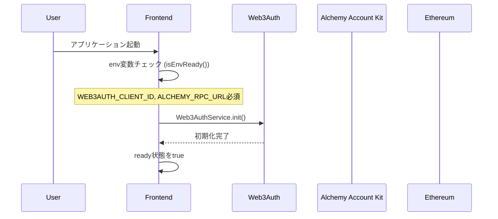
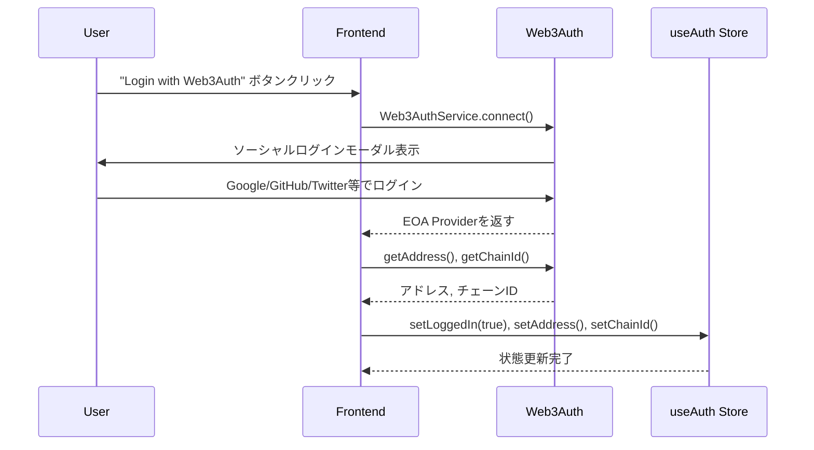
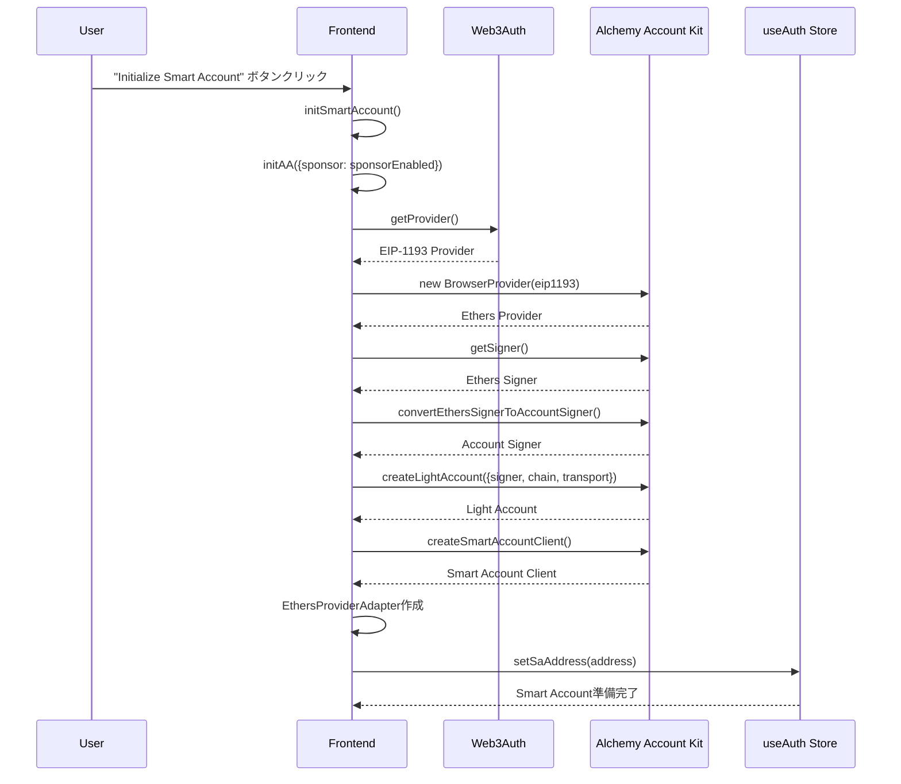
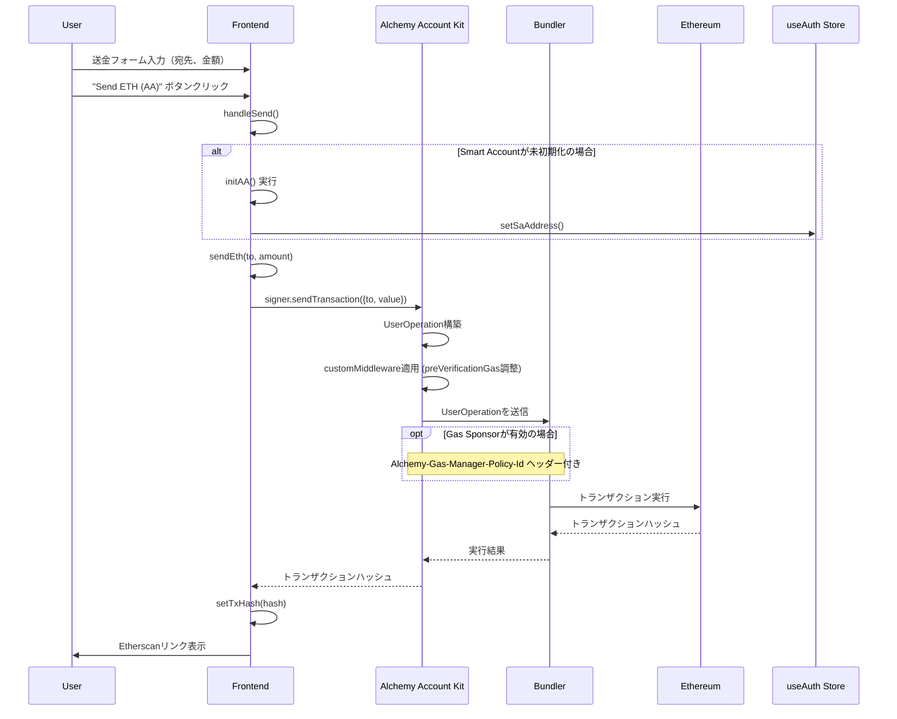
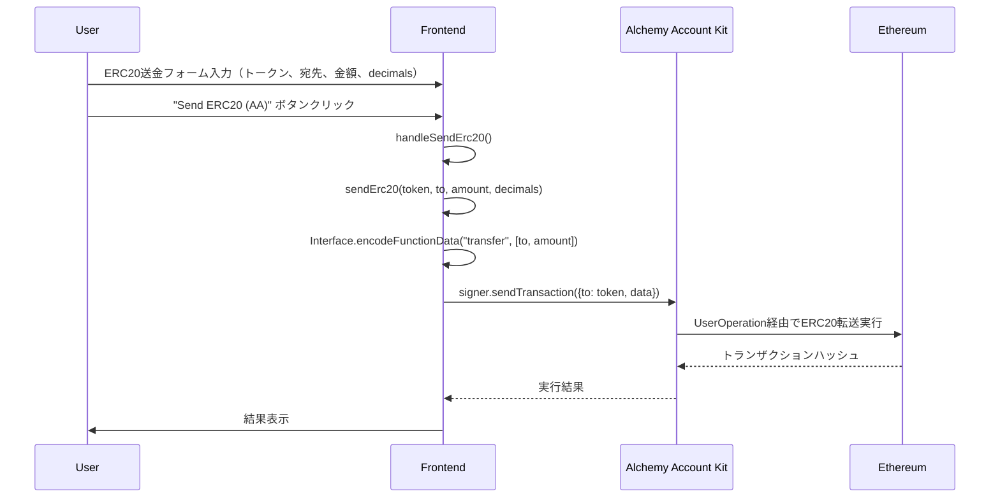
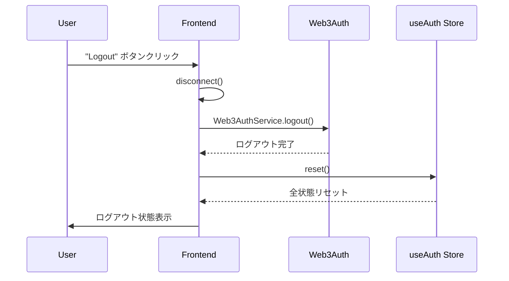

# AA Managed Demo - 全体シーケンス図

Web3Auth × Alchemy Account Kitを使用したAccount Abstraction（AA）デモアプリケーションの全体的なフローを示します。

## 基本構成要素

### コンポーネント
- **Frontend (Next.js)**: ユーザーインターフェース
- **Web3Auth**: ソーシャルログイン認証プロバイダー
- **Alchemy Account Kit**: Account Abstraction実装
- **Ethereum Network**: ブロックチェーンネットワーク（Sepolia テストネット）

### 主要ファイル構成
```
web/src/
├── app/page.tsx              # メインUIコンポーネント
├── lib/
│   ├── web3auth.ts          # Web3Auth サービスクラス
│   ├── aa.ts                # Account Abstraction 統合
│   └── env.ts               # 環境変数設定
└── state/useAuth.ts         # 認証状態管理（Zustand）
```

## シーケンスフロー

### 1. 初期化フェーズ



### 2. ログインフェーズ



### 3. Smart Account初期化フェーズ



### 4. ETH送金フェーズ



### 5. ERC20送金フェーズ



### 6. ログアウトフェーズ



## 環境変数

### 必須
- `NEXT_PUBLIC_WEB3AUTH_CLIENT_ID`: Web3AuthダッシュボードからのクライアントID
- `NEXT_PUBLIC_ALCHEMY_API_KEY` or `NEXT_PUBLIC_ALCHEMY_RPC_URL`: Alchemy RPC URL
- `NEXT_PUBLIC_DEFAULT_CHAIN_ID`: チェーンID（デフォルト: 11155111 = Sepolia）

### 任意
- `NEXT_PUBLIC_ALCHEMY_GAS_MANAGER_POLICY_ID`: ガススポンサー用ポリシーID

## ガス管理

### Sponsorモード（ON）
- Alchemy Gas Manager Policy IDを使用してガス代をスポンサー
- HTTP ヘッダーに `Alchemy-Gas-Manager-Policy-Id` を設定
- ユーザーはガス代支払い不要

### Sponsorモード（OFF）
- 従来通りユーザーがガス代を支払い
- Smart Accountの残高から自動的にETHが消費

## エラーハンドリング

### よくあるエラー
1. **"Expected valid bigint: 0 < bigint < curve.n"**: Web3Auth設定の問題 → 修正済み
2. **"WARNING! You are on sapphire_devnet"**: 開発ネットワーク警告 → SAPPHIRE_MAINNET に変更済み
3. **hCaptcha localhost警告**: ローカル開発環境での正常な警告
4. **aria-hidden accessibility警告**: Web3Authモーダルの標準動作

### 対処法
- 各フェーズでtry-catch を実装
- エラー状態をUIで適切に表示
- ログイン状態・初期化状態の適切な管理

## 技術スタック

### Frontend
- **Next.js 15**: React フレームワーク
- **Tailwind CSS 4**: スタイリング
- **Zustand**: 状態管理
- **TypeScript**: 型安全性

### Web3
- **Web3Auth Modal SDK**: ソーシャルログイン
- **Alchemy Account Kit**: Account Abstraction
- **Ethers.js 6**: Ethereum インタラクション
- **Viem**: 低レベル Ethereum ユーティリティ

この図は現在の実装を反映し、各フェーズでの処理フローと技術要素を明確に示しています。