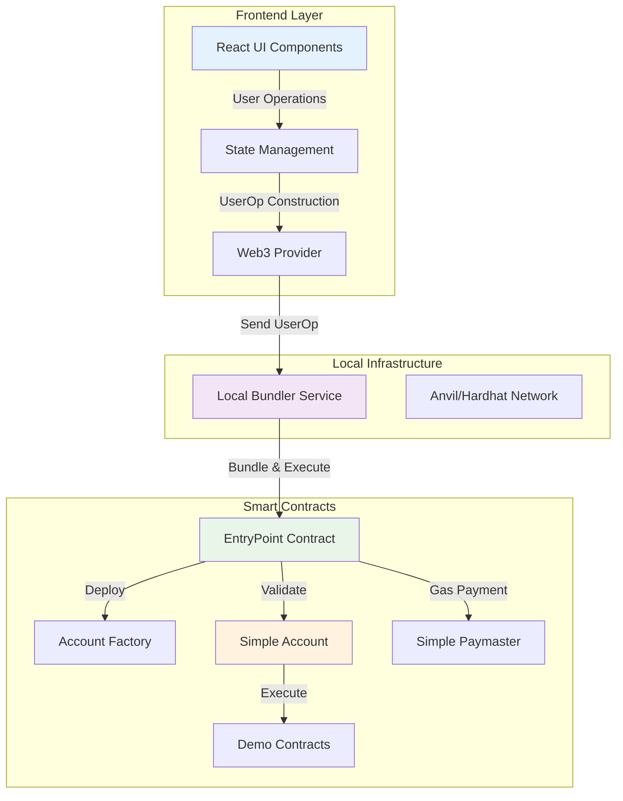

# Account Abstraction Demo App アーキテクチャ設計

## システム全体設計

### アーキテクチャ概要



## フォルダ構成

```
aa-demo/
├── bundler/                     # Git Submodule (eth-infinitism/bundler)
│   ├── packages/bundler/        # 公式bundler実装
│   ├── packages/validation-manager/
│   └── packages/utils/
│
├── packages/
│   ├── contracts/               # カスタムコントラクト (@account-abstraction/contracts使用)
│   │   ├── src/
│   │   │   ├── demo/           # デモ用コントラクト
│   │   │   │   ├── DemoToken.sol
│   │   │   │   ├── DemoNFT.sol
│   │   │   │   └── SimpleDEX.sol
│   │   │   └── paymaster/      # カスタムPaymaster
│   │   │       └── DemoPaymaster.sol
│   │   ├── test/
│   │   └── scripts/deploy.ts
│   │
│   └── frontend/                 # React フロントエンド
│       ├── src/
│       │   ├── components/
│       │   │   ├── WalletConnect/
│       │   │   ├── AccountInfo/
│       │   │   ├── DemoActions/
│       │   │   └── TransactionHistory/
│       │   ├── hooks/
│       │   │   ├── useAAWallet.ts
│       │   │   ├── useBundler.ts
│       │   │   └── usePaymaster.ts
│       │   ├── services/
│       │   │   ├── aa-provider.ts
│       │   │   └── contract-service.ts
│       │   └── utils/
│       └── package.json
│
├── scripts/
│   ├── setup.sh                 # 環境セットアップ
│   ├── start-local.sh           # ローカル環境起動
│   └── deploy-all.sh            # 全コントラクトデプロイ
│
└── docker-compose.yml           # 全サービスの統合
```

## コンポーネント設計詳細

### 1. Smart Contracts

#### SimpleAccount (Smart Wallet)
```solidity
contract SimpleAccount is BaseAccount {
    address public owner;
    
    function validateUserOp(UserOperation calldata userOp, bytes32 userOpHash, uint256 missingAccountFunds)
        external override returns (uint256 validationData);
    
    function execute(address dest, uint256 value, bytes calldata func) external;
    
    function executeBatch(address[] calldata dest, uint256[] calldata value, bytes[] calldata func) external;
}
```

#### SimpleAccountFactory
```solidity
contract SimpleAccountFactory {
    SimpleAccount public immutable accountImplementation;
    
    function createAccount(address owner, uint256 salt) public returns (SimpleAccount ret);
    
    function getAddress(address owner, uint256 salt) public view returns (address);
}
```

#### SimplePaymaster
```solidity
contract SimplePaymaster is BasePaymaster {
    mapping(address => uint256) public balanceOf;
    
    function validatePaymasterUserOp(UserOperation calldata userOp, bytes32 userOpHash, uint256 maxCost)
        external override returns (bytes memory context, uint256 validationData);
    
    function postOp(PostOpMode mode, bytes calldata context, uint256 actualGasCost) external override;
    
    function depositFor(address account) public payable;
}
```

### 2. Bundler Service

#### 基本機能
- UserOperation受信・検証
- ガス見積もり
- Entry Pointへの送信

```typescript
class LocalBundler {
    private mempool: UserOperationMempool;
    private validator: UserOperationValidator;
    private gasEstimator: GasEstimator;
    
    async sendUserOperation(userOp: UserOperation): Promise<string>;
    async bundleUserOperations(): Promise<string>;
    async estimateUserOperationGas(userOp: UserOperation): Promise<GasEstimate>;
}
```

### 3. Frontend Components

#### AAWallet Hook
```typescript
const useAAWallet = () => {
  const [smartAccount, setSmartAccount] = useState<string>();
  const [isDeployed, setIsDeployed] = useState<boolean>(false);
  
  const createWallet = async (owner: string) => { /* ... */ };
  const sendUserOperation = async (callData: string) => { /* ... */ };
  
  return { smartAccount, isDeployed, createWallet, sendUserOperation };
};
```

## 実装フェーズ

### Phase 1: コア実装
1. EntryPoint デプロイ
2. SimpleAccount + Factory 実装
3. 基本的なBundler機能
4. シンプルなUI作成

### Phase 2: Paymaster追加
1. SimplePaymaster実装
2. ガスレス取引の実現
3. デポジット管理機能

### Phase 3: Demo機能
1. Token送金デモ
2. NFTミントデモ
3. DEX操作デモ

### Phase 4: 改善・最適化
1. バッチ取引
2. 高度なUI/UX
3. エラーハンドリング強化

## 技術判断

### 使用ライブラリ・依存関係
- **Account Abstraction Core**: 
  - `@account-abstraction/contracts` (npm) - EntryPoint, SimpleAccount等
  - `@account-abstraction/sdk` (npm) - フロントエンド統合
- **Bundler**: 
  - `eth-infinitism/bundler` (git submodule) - 公式bundler実装
- **Development**: 
  - Hardhat + ethers.js
  - React + Vite + TypeScript
  - Jest + Hardhat tests

### 設計原則
1. **シンプル優先**: 学習目的のため複雑さを避ける
2. **モジュラー設計**: 各コンポーネントを独立して開発
3. **段階的実装**: MVPから始めて機能追加
4. **ローカル完結**: 外部依存を最小化

## セキュリティ考慮事項

### スマートコントラクト
- Reentrancy攻撃防止
- 適切なアクセス制御
- ガス制限の設定

### Bundler
- UserOperation検証の徹底
- DoS攻撃防止
- レート制限実装

### Frontend
- プライベートキー管理
- トランザクション内容の確認
- エラー時の適切な表示