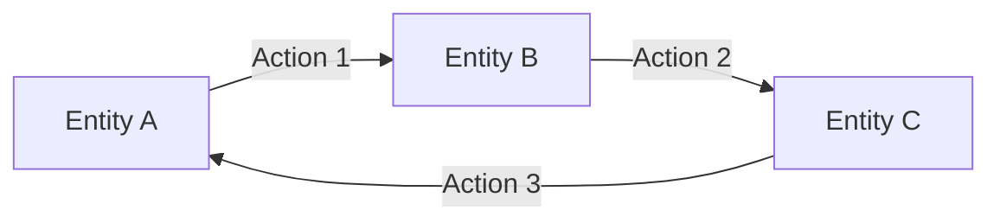
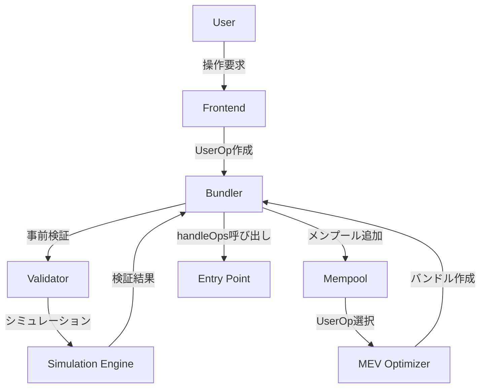
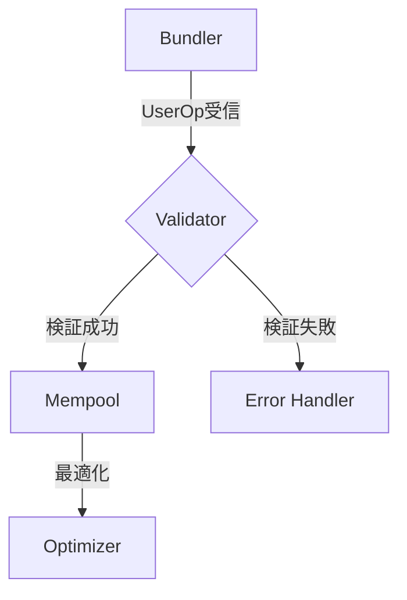
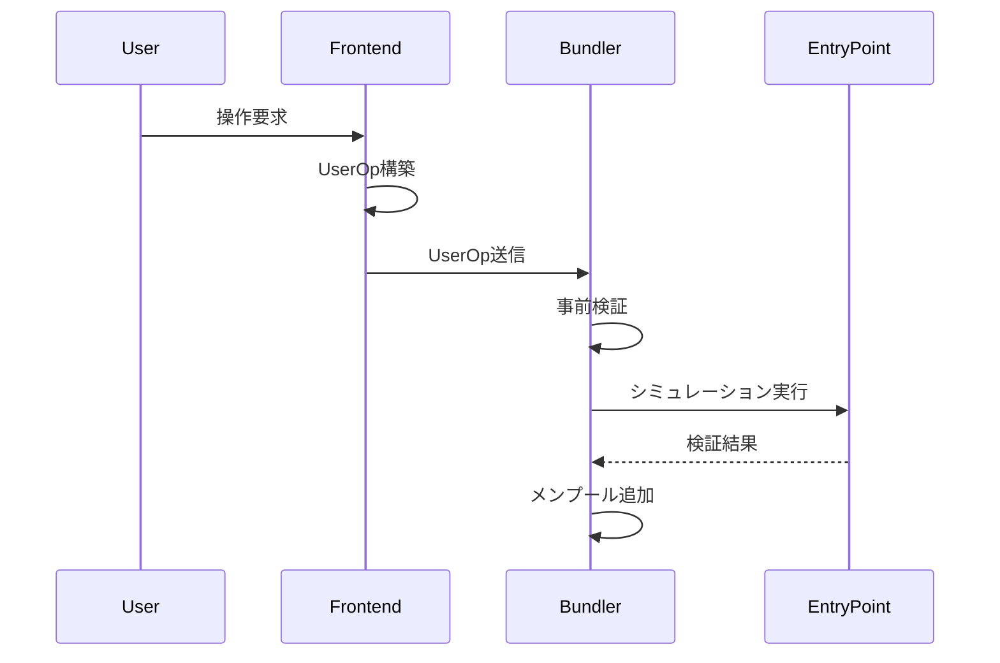
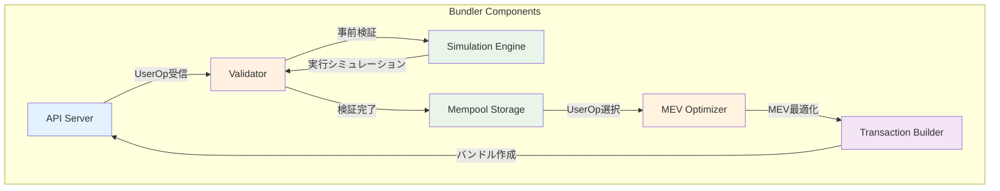
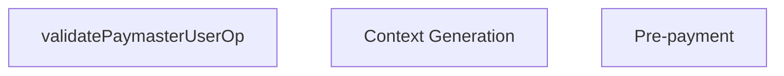
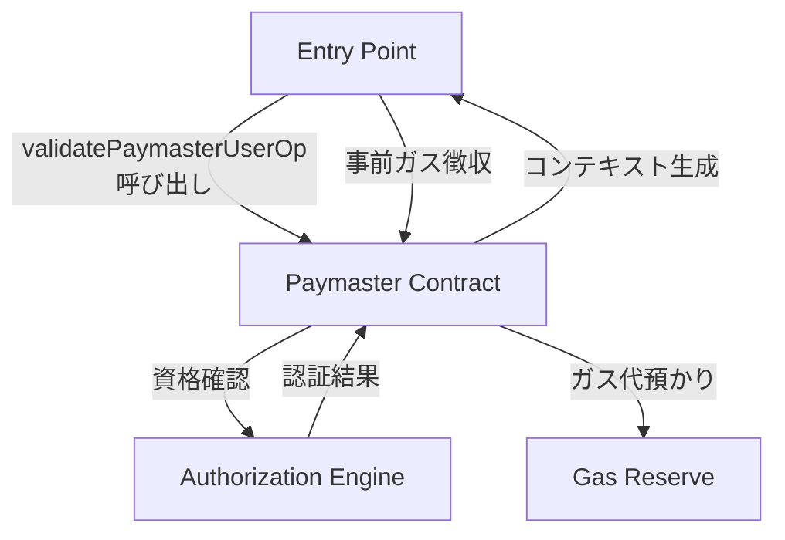

# Mermaid図表設計ルール

## Action vs Entity の明確な分離

### 基本原則
- **Entity（実体）**: ノード（四角・円）に配置 - 物理的・論理的に存在するコンポーネント
- **Action（処理）**: エッジ（線・矢印）に配置 - 動作、処理、機能、データの流れ

### 表記ルール

#### Entity（実体）の表記
- **配置**: ノード（四角、円、菱形）
- **形状**: `[角括弧]`, `(丸括弧)`, `((円))`, `{菱形}`
- **命名**: 名詞形（〜Engine, 〜Storage, 〜Contract, 〜Manager）
- **例**: `[Simulation Engine]`, `[Mempool Storage]`, `(Entry Point Contract)`

#### Action（処理）の表記  
- **配置**: エッジ（矢印線）のラベル
- **命名**: 動詞形（検証, 実行, 送信, validate, execute, send）
- **例**: `A -->|検証| B`, `C -->|UserOp送信| D`

### 改良例

#### Before（混在）:
```mermaid
subgraph "Validation Layer"
    PRE[Pre-validation]     # Action がノードに
    SIM[Simulation Engine]  # Entity
    GAS[Gas Estimation]     # Action がノードに
end
PRE --> SIM --> GAS
```

#### After（分離）:
```mermaid
subgraph "Validation Layer"
    VALIDATOR[Validator]
    SIM_ENGINE[Simulation Engine] 
    GAS_CALC[Gas Calculator]
end

VALIDATOR -->|事前検証| SIM_ENGINE
SIM_ENGINE -->|ガス見積もり| GAS_CALC
```

## フロー図での関係性表現

### 基本パターン


### 複雑な処理フロー


## 条件分岐の表現

### 判定ロジックもエッジに


## シーケンス図でのAction表現

### メッセージ = Action


## 色分けルール

### Entity
- **Core Components**: `fill:#e3f2fd` 
- **Data Storage**: `fill:#e8f5e8`
- **External Systems**: `fill:#fff3e0`
- **Contracts**: `fill:#f3e5f5`
- **Error/Alert**: `fill:#ffebee`

### Action（エッジスタイル）
- **Normal Flow**: 実線矢印
- **Error Flow**: 点線矢印 `-.->` 
- **Optional Flow**: 波線矢印
- **Heavy Processing**: 太線矢印

## Bundler アーキテクチャ改良例

### Before:
```mermaid
subgraph "Bad: Action in Nodes"
    API[API Server]
    PRE[Pre-validation]
    SIM[Simulation]
    MEMPOOL[Mempool]
end
```

### After:


## Paymaster フロー改良例

### Before:


### After:


## 禁止パターン

❌ **Action をノードに配置**
```mermaid
graph TD
    A[Component] --> B[Validation] --> C[Component]
    # Validation は処理なのでノードにすべきでない
```

✅ **Action をエッジに配置**  
```mermaid
graph TD
    A[Component] -->|validation| C[Component]
    # validation は処理なのでエッジラベルに
```

❌ **Entity をエッジに配置**
```mermaid
graph TD
    A -->|Database| B
    # Database は実体なのでエッジにすべきでない
```

✅ **Entity をノードに配置**
```mermaid
graph TD
    A[Component A] -->|データ書き込み| B[Database]
    # Database は実体なのでノードに
```

## 適用ガイドライン

### 1. ノードの判定
- 「これは物理的・論理的に存在するか？」→ Yes なら Entity
- 「これはデータを保存・処理するか？」→ Yes なら Entity

### 2. エッジの判定  
- 「これは動作・処理か？」→ Yes なら Action
- 「これは何かから何かへの流れか？」→ Yes なら Action

### 3. 迷った時のルール
- 名詞なら Entity → ノード
- 動詞なら Action → エッジ
- 「〜ing」なら Action → エッジ

## メモリーバンク適用

このルールは今後作成する全Mermaid図に適用し、既存図表も順次このパターンで更新する。特に：

- `research/aa_components_detailed.md` のBundler図
- 全体アーキテクチャ図
- UserOperationフロー図

を優先的に改良する。