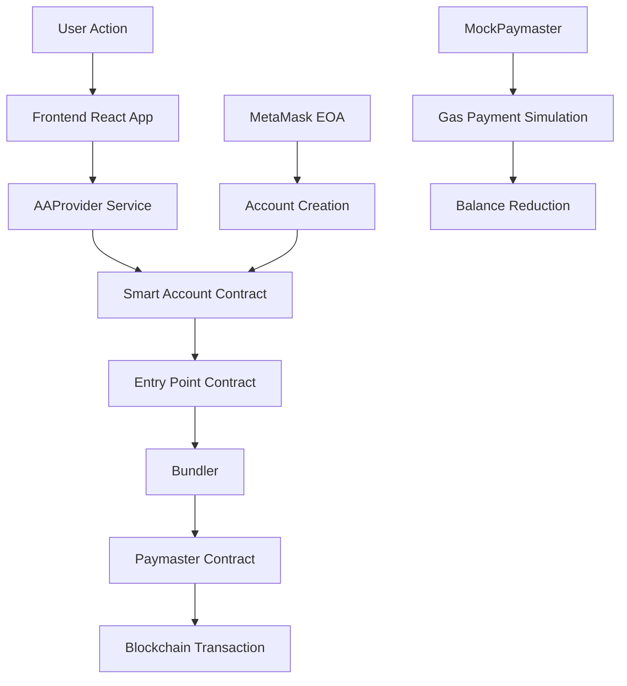

# 現在の Git 状況と Paymaster 実装の試行状況

## プロジェクト全体のアーキテクチャ設計

### 1. 技術スタック構成

```
aa/ (プロジェクトルート)
├── packages/
│   ├── contracts/     # Solidityスマートコントラクト
│   │   ├── contracts/
│   │   │   ├── demo/DemoNFT.sol           # テスト用NFTコントラクト
│   │   │   ├── paymaster/MockPaymaster.sol # ガス代支払いコントラクト
│   │   │   └── SimpleAccount.sol          # AA準拠スマートアカウント
│   │   ├── scripts/                       # デプロイスクリプト
│   │   └── typechain-types/              # 自動生成TypeScript型
│   ├── frontend/      # React + TypeScript フロントエンド
│   │   ├── src/
│   │   │   ├── components/               # UI コンポーネント
│   │   │   ├── hooks/                   # カスタムReact hooks
│   │   │   └── services/aa-provider.ts  # AA機能のコアサービス
│   └── bundler/       # ERC-4337 UserOperation bundler
```

### 2. Account Abstraction (AA) アーキテクチャ



### 3. コンポーネント間の依存関係

#### フロントエンド構成:

- **App.tsx**: メインアプリケーション、接続状態管理
- **WalletConnect.tsx**: MetaMask 接続 UI
- **AccountInfo.tsx**: スマートアカウント情報表示、残高管理
- **DemoActions.tsx**: NFT mint 等のアクション実行
- **TransactionHistory.tsx**: トランザクション履歴表示
- **useAAWallet.ts**: AA 機能の React hook
- **aa-provider.ts**: AA 機能のコアロジック

#### スマートコントラクト構成:

- **SimpleAccount**: ERC-4337 準拠のスマートウォレット
- **DemoNFT**: テスト用 NFT コントラクト（ERC-721）
- **MockPaymaster**: ガス代支払い（実験的実装）

### 4. データフロー設計

#### アカウント作成フロー:

1. MetaMask EOA 生成・接続
2. CREATE2 でスマートアカウントアドレス計算
3. 初回トランザクションでスマートアカウントデプロイ
4. LocalStorage でアカウント情報永続化

#### トランザクション実行フロー:

1. ユーザーアクション（例: NFT mint）
2. UserOperation 生成
3. Paymaster 署名取得（現在は Mock 実装）
4. Bundler 経由でトランザクション実行
5. イベントリスナーで UI 更新

### 5. 設定とデプロイメント構成

#### 環境設定:

- **Hardhat**: ローカル開発環境（localhost:8545）
- **MetaMask**: EOA ウォレット接続
- **React Dev Server**: フロントエンド開発サーバー
- **Bundler**: ERC-4337 UserOperation 処理

#### デプロイ構成:

```json
{
  "entryPoint": "0x4337084D9E255Ff0702461CF8895CE9E3b5Ff108",
  "simpleAccountFactory": "動的生成",
  "mockPaymaster": "動的生成",
  "demoNFT": "動的生成"
}
```

## Commit 済みの構成 (最新から 5 件)

- `6675b62` feat: Add GEMINI.md for project instructions and enhance AAProvider with initialization and transaction history improvements
- `bdd6cce` feat: Enhance App component with connection restoration and add TransactionHistory component
- `17c7438` feat: Add deployment files and enhance transaction handling in frontend components
- `e6e1a5c` feat: Enhance AA Wallet integration with local storage and auto-connection
- `6cb8225` feat: add SimpleAccount and SimpleAccountFactory types and factories

## Unstaged Changes (試行中の作業内容)

### 主要な変更目的: 実際に動作する Paymaster の実装

#### 1. MockPaymaster.sol の拡張 (packages/contracts/contracts/paymaster/MockPaymaster.sol)

**変更内容:**

```solidity
// 新規追加メソッド
function payGas(address user, uint256 gasUsed) external {
    require(msg.sender == owner, "Only owner can pay gas");
    uint256 gasCost = gasUsed * 2 gwei;
    if (address(this).balance >= gasCost) {
        totalGasUsed += gasUsed;
        payable(owner).transfer(gasCost);
        emit GasPaid(user, gasUsed, gasCost);
    }
}

function getGasBalance() external view returns (uint256) {
    return address(this).balance;
}

// 追加状態変数とイベント
uint256 public totalGasUsed;
event GasPaid(address indexed user, uint256 gasUsed, uint256 gasCost);
```

**目的:** paymaster が実際にガス代を支払い、残高が減る仕組みの実現

#### 2. AAProvider (packages/frontend/src/services/aa-provider.ts) の改善

**変更内容:**

- EntryPoint アドレス変更: `0x5FF137D4b0FDCD49DcA30c7CF57E578a026d2789` → `0x4337084D9E255Ff0702461CF8895CE9E3b5Ff108`
- `simulatePaymasterGasPayment()` メソッド追加:

```typescript
private async simulatePaymasterGasPayment(user: string, estimatedGas: number): Promise<void> {
    const signer = this.provider.getSigner()
    const paymasterWithSigner = this.paymasterContract.connect(signer)
    const gasPayTx = await (paymasterWithSigner as any).payGas(user, estimatedGas)
    await gasPayTx.wait()
}
```

- TypeScript 型エラー修正 (`as any` キャスト追加)
- NFT mint 後の paymaster gas payment シミュレーション

#### 3. AccountInfo.tsx の改善 (packages/frontend/src/components/AccountInfo.tsx)

**変更内容:**

- paymaster 使用イベントのリスナー追加
- 残高表示のリアルタイム更新
- useEffect の構文修正（`useEffect(() => { const loadAccountData = async () => {` から正しい関数定義へ）

#### 4. useAAWallet.ts の改善 (packages/frontend/src/hooks/useAAWallet.ts)

**変更内容:**

- 新しいアカウント作成時の salt 使用ロジック修正
- `newAccountSalt` の適切な処理

## Untracked Files (新規作成したが未コミット)

### 試行錯誤で作成された Paymaster バリエーション:

- `SimplePaymaster.sol` - EntryPoint 対応版 (コンパイルエラーで断念)
- `UniversalPaymaster.sol` - 全トランザクション受入版 (EntryPoint 互換性問題)
- 関連 TypeScript 型定義ファイル群

### 追加スクリプト:

- `deploy-with-entrypoint.ts` - EntryPoint 込みデプロイ (実行失敗)
- `fund-paymaster.ts` - paymaster 資金供給スクリプト
- `create-and-fund-account.ts` - アカウント作成・資金供給

## 失敗している問題

### 1. EntryPoint 互換性問題

**問題:** `@account-abstraction/contracts` v0.7.0 の EntryPoint と実際の bundler の EntryPoint アドレス (`0x4337084D9E255Ff0702461CF8895CE9E3b5Ff108`) が一致しない
**結果:** ERC-4337 対応 paymaster のデプロイが失敗
**技術詳細:** bundler が期待する EntryPoint インターフェースと@account-abstraction/contracts の v0.7.0 インターフェースに非互換性

### 2. TypeScript 型エラー

**問題:** ethers.js BaseContract で動的メソッド呼び出しの型エラー

```typescript
// エラー例
Property 'payGas' does not exist on type 'BaseContract & Omit<ContractInterface, keyof BaseContract>'
```

**対応:** `as any` キャストで回避（応急処置）

### 3. start:all スクリプト実行エラー

**問題:** npm workspace 内でのスクリプト実行パス問題
**結果:** 統合起動が失敗、個別の `npm run start:frontend` と `npm run start:bundler` が必要

### 4. UserOperation 構築の複雑さ

**問題:** ERC-4337 の完全な UserOperation 構築には nonce 管理、署名、ガス推定等の複雑な処理が必要
**結果:** 簡易実装での代替を選択

### 実装戦略:

1. **Hybrid Paymaster 実装**: ERC-4337 標準に完全準拠せず、実用的なガス支払いシミュレーションを提供
2. **フロントエンド中心**: AAProvider でスマートコントラクト操作を抽象化
3. **イベント駆動 UI**: blockchain events でリアルタイム更新
4. **段階的改善**: 完璧な ERC-4337 対応よりも動作する実装を優先
