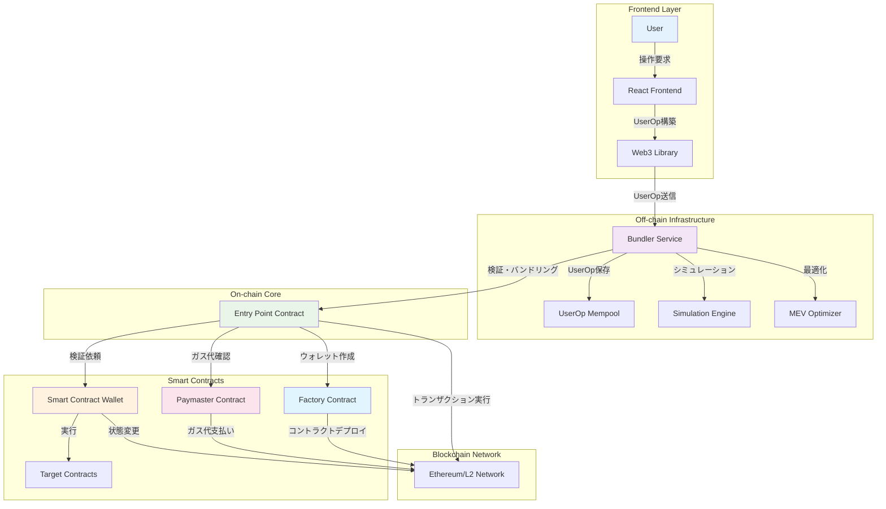
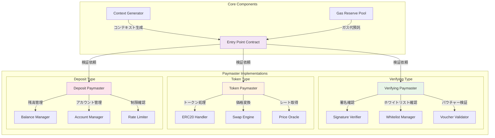
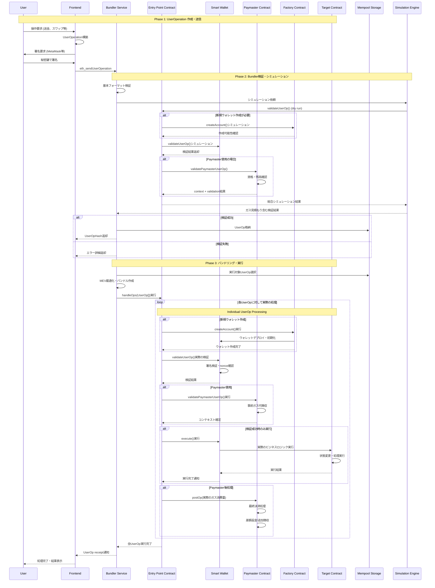
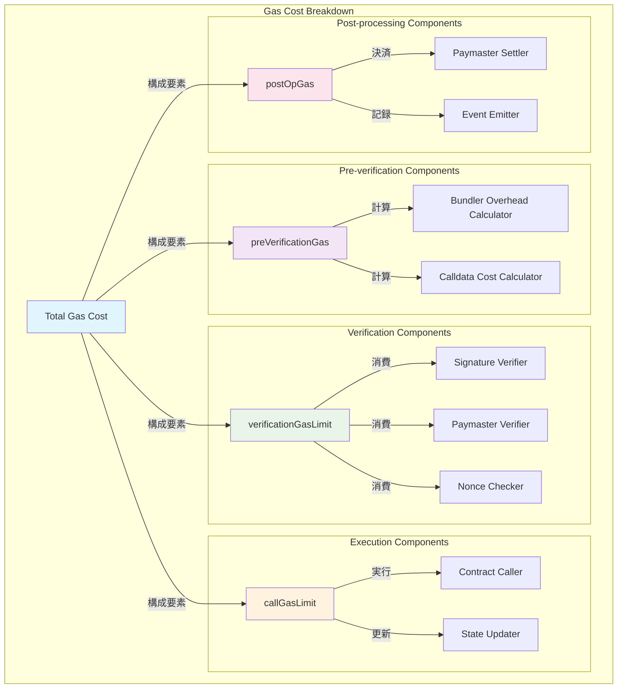
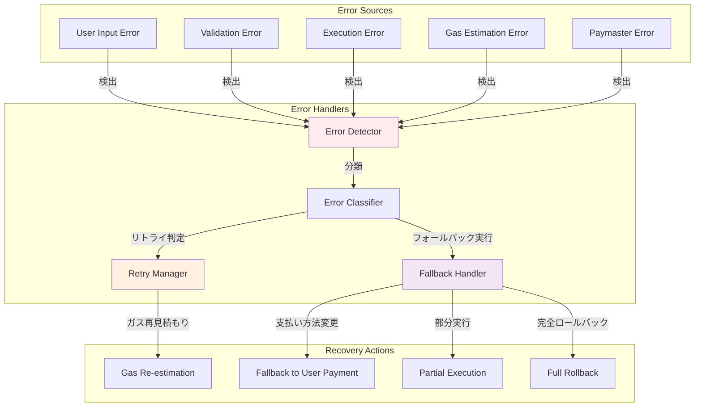
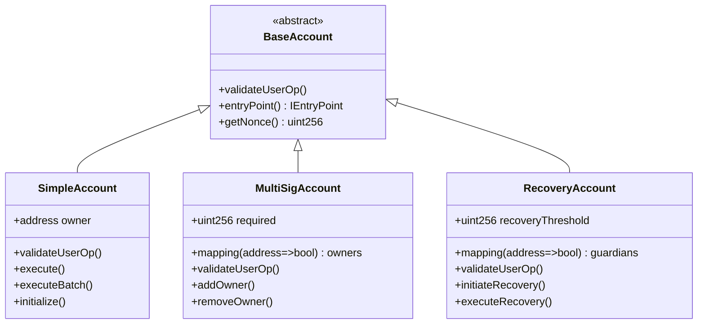

# Account Abstraction コンポーネント詳細解説（改良版）

## AA全体のアーキテクチャ（Entity=ノード、Action=エッジ）



## 1. Bundler（バンドラー）詳細アーキテクチャ（改良版）

### 役割
- **UserOperationの収集**: 複数ユーザーからのUserOpを集める
- **事前検証**: オフチェーンでUserOpの妥当性をチェック
- **バンドリング**: 複数のUserOpを1つのトランザクションにまとめる
- **オンチェーン送信**: Entry Pointに送信して実行

```mermaid
graph TD
    subgraph "Bundler Components"
        API_SERVER[JSON-RPC API Server]
        VALIDATOR[Request Validator]
        SIM_ENGINE[Simulation Engine]
        GAS_CALC[Gas Calculator]
        MEMPOOL_MGR[Mempool Manager]
        PRIORITY_Q[Priority Queue]
        DEDUP_ENGINE[Deduplication Engine]
        USER_SELECTOR[UserOp Selector]
        MEV_OPT[MEV Optimizer]
        TX_BUILDER[Transaction Builder]
        CHAIN_SENDER[Chain Sender]
        MONITOR[Status Monitor]
    end
    
    API_SERVER -->|UserOp受信| VALIDATOR
    VALIDATOR -->|事前検証| SIM_ENGINE
    SIM_ENGINE -->|シミュレーション実行| GAS_CALC
    GAS_CALC -->|ガス見積もり| MEMPOOL_MGR
    MEMPOOL_MGR -->|UserOp格納| PRIORITY_Q
    PRIORITY_Q -->|優先度付け| DEDUP_ENGINE
    DEDUP_ENGINE -->|重複除去| USER_SELECTOR
    USER_SELECTOR -->|UserOp選択| MEV_OPT
    MEV_OPT -->|MEV最適化| TX_BUILDER
    TX_BUILDER -->|バンドル構築| CHAIN_SENDER
    CHAIN_SENDER -->|オンチェーン送信| MONITOR
    
    style API_SERVER fill:#e3f2fd
    style SIM_ENGINE fill:#e8f5e8
    style MEMPOOL_MGR fill:#e8f5e8
    style MEV_OPT fill:#fff3e0
    style CHAIN_SENDER fill:#fce4ec
```



## 2. Paymaster パターン詳細（改良版）



## 3. 完全なUserOperation データフロー（Paymaster、Factory含む）



## 4. ガス計算とコストモデル（改良版）



## 5. エラーハンドリングと復旧フロー（改良版）



## 6. UserOperation構造とコンポーネント関係

### UserOperation構造
```typescript
interface UserOperation {
  sender: string;          // ウォレットアドレス
  nonce: BigNumber;       // リプレイ攻撃防止
  initCode: string;       // ウォレット初期化コード
  callData: string;       // 実際の実行データ
  callGasLimit: BigNumber;
  verificationGasLimit: BigNumber;
  preVerificationGas: BigNumber;
  maxFeePerGas: BigNumber;
  maxPriorityFeePerGas: BigNumber;
  paymasterAndData: string; // Paymaster情報
  signature: string;       // 署名
}
```

### Smart Wallet内部構造


## 学習での実装優先順位

1. **Simple Account Wallet**: 基本的な署名検証のみ
2. **Factory**: CREATE2でのウォレット展開
3. **Basic Bundler**: 単一UserOpの処理
4. **Simple Paymaster**: デポジット型の代理支払い
5. **Frontend Integration**: React UIでの操作
6. **Advanced Features**: マルチシグ、バッチ処理等