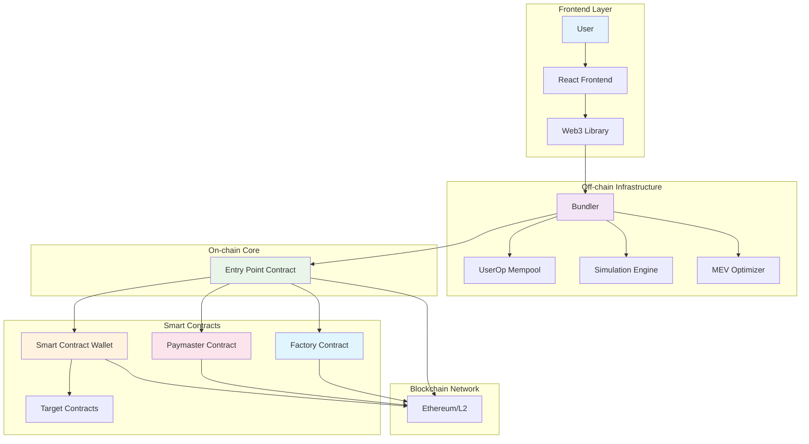
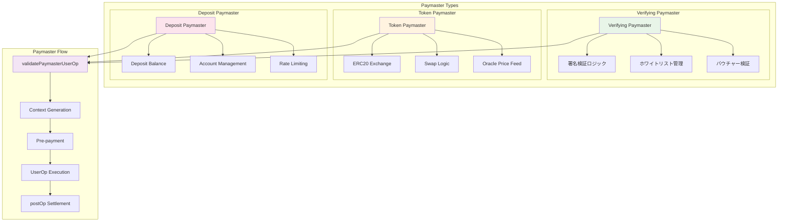
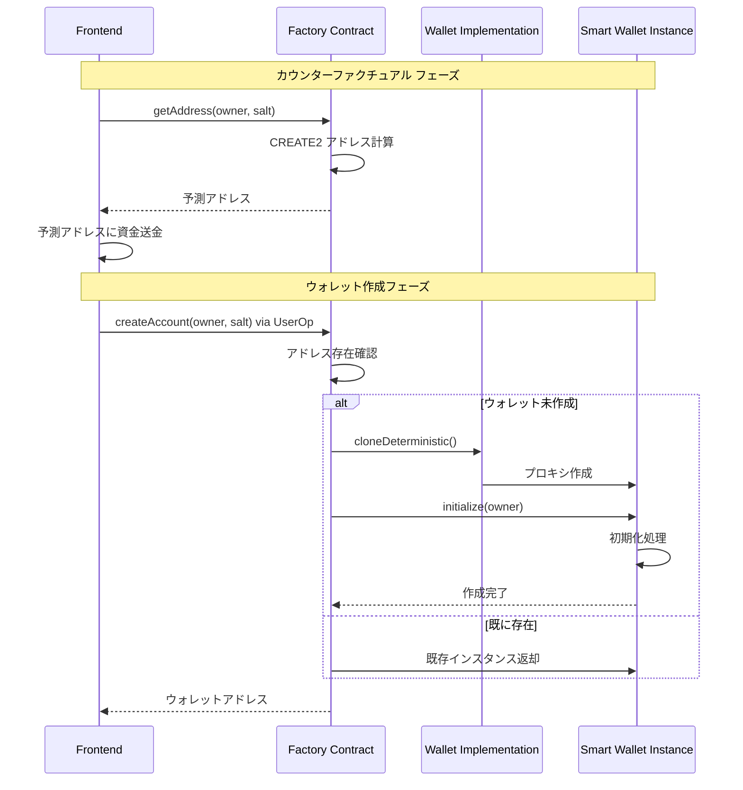
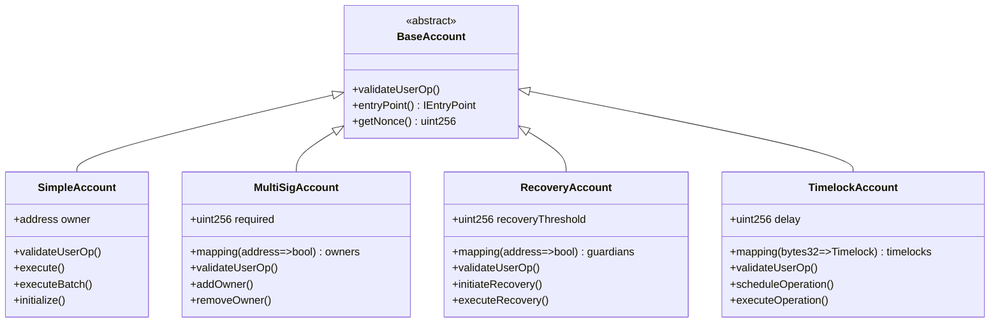
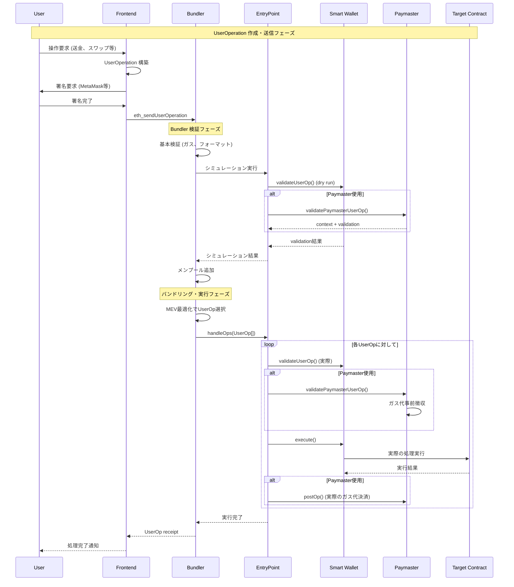
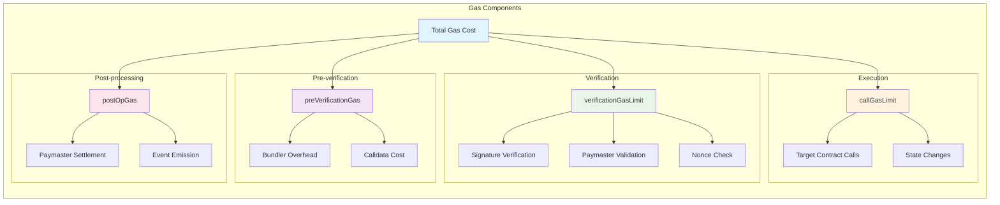

# Account Abstraction コンポーネント詳細解説

## AA全体のアーキテクチャ



## 1. Bundler（バンドラー）

### 役割
- **UserOperationの収集**: 複数ユーザーからのUserOpを集める
- **事前検証**: オフチェーンでUserOpの妥当性をチェック
- **バンドリング**: 複数のUserOpを1つのトランザクションにまとめる
- **オンチェーン送信**: Entry Pointに送信して実行

### 詳細アーキテクチャ

```mermaid
flowchart TD
    subgraph "Bundler Internal Architecture"
        API[JSON-RPC API Server]
        
        subgraph "Validation Layer"
            PRE[Pre-validation]
            SIM[Simulation Engine]
            GAS[Gas Estimation]
        end
        
        subgraph "Mempool Management"
            MP[Mempool Storage]
            PRIO[Priority Queue]
            DEDUP[Deduplication]
        end
        
        subgraph "Bundle Creation"
            SEL[UserOp Selection]
            OPT[MEV Optimization]
            BATCH[Bundle Creation]
        end
        
        subgraph "Execution"
            TX[Transaction Builder]
            SEND[Chain Sender]
            MON[Monitoring]
        end
    end
    
    API --> PRE
    PRE --> SIM
    SIM --> GAS
    GAS --> MP
    MP --> PRIO
    PRIO --> DEDUP
    DEDUP --> SEL
    SEL --> OPT
    OPT --> BATCH
    BATCH --> TX
    TX --> SEND
    SEND --> MON
    
    style API fill:#e3f2fd
    style SIM fill:#f3e5f5
    style MP fill:#e8f5e8
    style OPT fill:#fff3e0
    style SEND fill:#fce4ec
```



### 動作フロー
1. **UserOp受信**: JSON-RPC経由でUserOperationを受信
2. **シミュレーション**: ガス計算と実行可能性を確認
3. **メンプール管理**: 有効なUserOpをメンプールに保存
4. **バンドル作成**: 利益最大化のためUserOpを選択・組み合わせ
5. **オンチェーン実行**: handleOps()をEntry Pointで呼び出し

### 経済モデル
- **MEV機会**: ガス差額やPaymaster報酬で利益を得る
- **競争環境**: 複数のBundlerが競合
- **リスク**: 失敗したUserOpのガス代負担

### UserOperation構造
```typescript
interface UserOperation {
  sender: string;          // ウォレットアドレス
  nonce: BigNumber;       // リプレイ攻撃防止
  initCode: string;       // ウォレット初期化コード
  callData: string;       // 実際の実行データ
  callGasLimit: BigNumber;
  verificationGasLimit: BigNumber;
  preVerificationGas: BigNumber;
  maxFeePerGas: BigNumber;
  maxPriorityFeePerGas: BigNumber;
  paymasterAndData: string; // Paymaster情報
  signature: string;       // 署名
}
```

## 2. Paymaster（ペイマスター）

### 役割
- **ガス代代理支払い**: ユーザーの代わりにガス代を支払う
- **柔軟な料金モデル**: ETH以外のトークンでの支払い受付
- **スポンサーシップ**: 企業がユーザーのガス代を負担

### Paymasterパターン詳細



### Paymasterの種類

#### A. Verifying Paymaster
- **署名検証型**: 事前に署名されたバウチャーを検証
- **使用例**: プリペイド型、ホワイトリスト型

#### B. Token Paymaster  
- **トークン交換型**: ERC-20トークンでガス代を受け取る
- **使用例**: USDCでガス代支払い

#### C. Deposit Paymaster
- **デポジット型**: 事前にデポジットされた資金を使用
- **使用例**: サブスクリプション型アプリ

### 実装例（概念）
```solidity
contract SimplePaymaster is BasePaymaster {
    mapping(address => uint256) public deposits;
    
    function validatePaymasterUserOp(
        UserOperation calldata userOp,
        bytes32 userOpHash,
        uint256 maxCost
    ) external view override returns (bytes memory context) {
        // 1. ユーザーの資格確認
        // 2. ガス代の事前計算
        // 3. 支払い能力の確認
    }
    
    function postOp(
        PostOpMode mode,
        bytes calldata context,
        uint256 actualGasCost
    ) external override {
        // 実際のガス代の決済処理
    }
}
```

## 3. Factory Contract（ファクトリー）

### 役割
- **ウォレット展開**: 新しいスマートコントラクトウォレットの作成
- **決定論的アドレス**: CREATE2による予測可能なアドレス生成
- **初期化**: ウォレットの初期設定

### Factory詳細フロー



### CREATE2の利点
- **アドレス事前計算**: デプロイ前にアドレスが分かる
- **カウンターファクチュアル**: 実際にデプロイする前に送金可能
- **セキュリティ**: saltによる一意性保証

### 実装例
```solidity
contract SimpleAccountFactory {
    IEntryPoint public immutable entryPoint;
    
    function createAccount(
        address owner,
        uint256 salt
    ) public returns (SimpleAccount ret) {
        address addr = getAddress(owner, salt);
        uint codeSize = addr.code.length;
        if (codeSize > 0) {
            return SimpleAccount(payable(addr));
        }
        
        ret = SimpleAccount(payable(Clones.cloneDeterministic(
            accountImplementation, 
            _salt
        )));
        ret.initialize(owner);
    }
    
    function getAddress(address owner, uint256 salt)
        public view returns (address) {
        return Clones.predictDeterministicAddress(
            accountImplementation,
            _salt
        );
    }
}
```

## 4. Smart Contract Wallet

### 基本機能
- **署名検証**: カスタム署名方式の実装
- **実行ロジック**: トランザクションの実行
- **アップグレード**: プロキシパターンでの機能拡張

### Wallet内部構造



### セキュリティ機能
- **マルチシグ**: 複数署名による承認
- **時間ロック**: 重要な操作の遅延実行
- **支出制限**: 1日あたりの支出上限
- **ホワイトリスト**: 許可されたアドレスのみとの取引

### 実装例（シンプル版）
```solidity
contract SimpleAccount is BaseAccount {
    address public owner;
    IEntryPoint private immutable _entryPoint;
    
    function validateUserOp(
        UserOperation calldata userOp,
        bytes32 userOpHash,
        uint256 missingAccountFunds
    ) external override returns (uint256 validationData) {
        // 1. 署名の検証
        // 2. nonce の確認
        // 3. ガス代の事前支払い
    }
    
    function execute(
        address dest,
        uint256 value,
        bytes calldata func
    ) external {
        _requireFromEntryPoint();
        _call(dest, value, func);
    }
}
```

## 5. UserOperation データフロー



## 6. ガス計算とコストモデル



### 各段階のガス消費
1. **Pre-verification**: UserOpのサイズ・複雑さに基づく
2. **Validation**: 署名検証、Paymaster検証
3. **Execution**: 実際のスマートコントラクト呼び出し  
4. **Post-op**: Paymaster の後処理

## 全体の相互作用

### 正常フロー
1. **ユーザー**: UserOperationを作成・署名
2. **Bundler**: UserOpを受信・検証・メンプール追加
3. **Bundler**: 複数UserOpをバンドルしてEntry Pointに送信
4. **Entry Point**: 各UserOpを順次検証・実行
5. **Wallet**: 署名検証後、実際の処理を実行
6. **Paymaster**: 必要に応じてガス代を代理支払い

### エラーハンドリング
- **検証失敗**: UserOpがリジェクトされる
- **実行失敗**: 個別のUserOpのみ失敗、他は継続
- **ガス不足**: Paymasterまたはユーザーの責任

## 学習での実装優先順位

1. **Simple Account Wallet**: 基本的な署名検証のみ
2. **Factory**: CREATE2でのウォレット展開
3. **Basic Bundler**: 単一UserOpの処理
4. **Simple Paymaster**: デポジット型の代理支払い
5. **Frontend Integration**: React UIでの操作
6. **Advanced Features**: マルチシグ、バッチ処理等