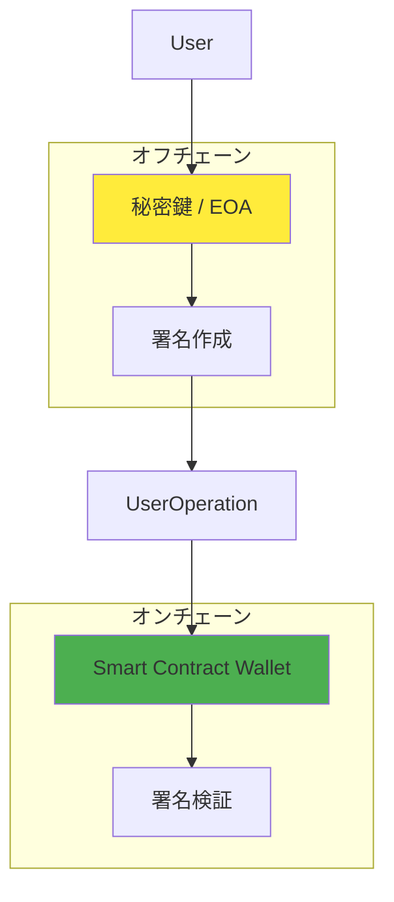
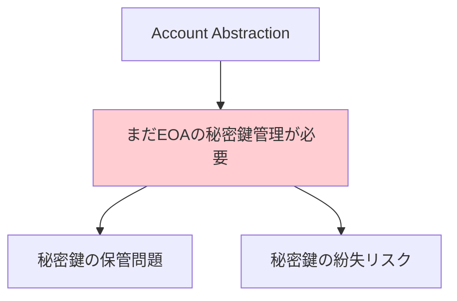
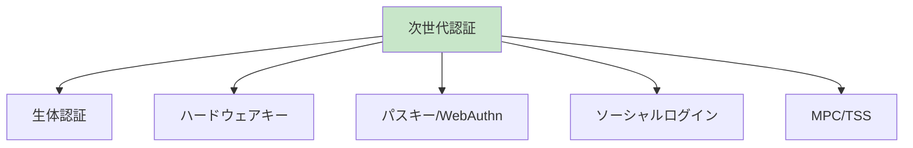

# EOA vs AA の関係性

## 重要な認識：AAでもEOAは必要

### EOAが完全に不要になるわけではない



## 現実的な署名の仕組み

### 1. 基本パターン：EOA + Smart Wallet
```typescript
// 実際の署名フロー
const userPrivateKey = "0x..."; // 結局EOAの秘密鍵が必要
const userEOA = new ethers.Wallet(userPrivateKey);

// Smart Walletのowner として EOA address を設定
const smartWallet = await factory.createAccount(
    userEOA.address, // EOAアドレスをownerに
    salt
);

// UserOperationに署名（EOAの秘密鍵で）
const signature = await userEOA.signMessage(userOpHash);
```

### 2. Smart Walletでの検証
```solidity
contract SimpleAccount {
    address public owner; // EOAアドレス
    
    function validateUserOp(...) {
        bytes32 hash = userOpHash.toEthSignedMessageHash();
        address recovered = hash.recover(userOp.signature);
        
        // EOAアドレスと照合
        if (recovered != owner) {
            return SIG_VALIDATION_FAILED;
        }
        return 0;
    }
}
```

## AAが解決する問題の再整理

### AAは「EOAを不要にする」のではなく「EOAの制約を解決」する

#### 従来のEOA の制約：
1. **ガス代の事前準備必須** → AAはPaymasterで解決
2. **固定的な署名方式** → AAはカスタム検証で解決  
3. **復旧不可** → AAはソーシャルリカバリーで解決
4. **バッチ処理不可** → AAは複数操作をまとめて実行
5. **アップグレード不可** → AAはプロキシで機能追加

#### AAのメリット：
- **EOAの秘密鍵管理は残る** が、その制約が大幅に緩和される
- **複数のEOA** をマルチシグで組み合わせ可能
- **Paymaster** でガス代問題を解決
- **カスタムロジック** で柔軟な認証

## 実際の構成パターン

### パターン1：1つのEOA + Smart Wallet
```
User EOA (秘密鍵1つ) → Smart Contract Wallet → 柔軟な機能
```
- 最もシンプル
- ガス代やバッチ処理の恩恵あり
- 復旧問題は残る

### パターン2：マルチシグ Smart Wallet  
```
User EOA1 (秘密鍵1) ──┐
User EOA2 (秘密鍵2) ──┤→ Smart Contract Wallet
User EOA3 (秘密鍵3) ──┘
```
- 3つのEOAが必要
- 2-of-3 や 3-of-5 等のマルチシグ
- 1つの鍵を紛失しても安全

### パターン3：ソーシャルリカバリー
```
Owner EOA (メイン秘密鍵) ──┐
Guardian EOA1             ──┤→ Smart Contract Wallet  
Guardian EOA2             ──┤   (リカバリ機能付き)
Guardian EOA3             ──┘
```
- メイン鍵 + 複数のガーディアン鍵
- メイン鍵紛失時、ガーディアンがリカバリ実行

## 将来の展望：鍵管理の進化

### 現在の制約


### 将来の可能性


#### 新しい署名方式の可能性：
1. **WebAuthn**: ブラウザの生体認証
2. **パスキー**: Apple/Google の認証システム
3. **MPC (Multi-Party Computation)**: 分散鍵生成
4. **TSS (Threshold Signature Schemes)**: 閾値署名
5. **ハードウェアキー**: YubiKey等

## 実装での考慮事項

### 学習段階での推奨アプローチ：
1. **段階1**: 単一EOA + SimpleAccount (基本理解)
2. **段階2**: マルチシグ対応 (複数EOA管理)  
3. **段階3**: ソーシャルリカバリー (EOA代替手段)
4. **段階4**: 新しい認証方式の実験

### セキュリティ設計：
- **EOA秘密鍵の安全な管理**: ハードウェアウォレット推奨
- **複数の認証手段**: Single Point of Failure回避
- **段階的セキュリティ**: リスクに応じた認証強度

## 結論

**AAはEOAを完全に置き換えるものではなく、EOAの制約を解決する仕組み**

- 秘密鍵管理の問題は依然として存在
- しかし、その制約（ガス代、固定署名、復旧不可等）は大幅に改善
- 将来的にはより安全で使いやすい認証方式への道筋を提供