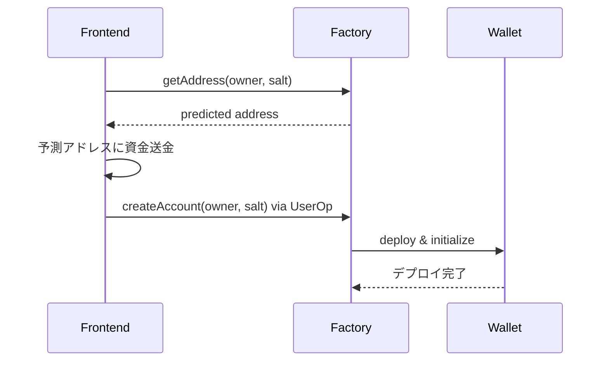

# eth-infinitism ライブラリガイド

## eth-infinitismとは

eth-infinitismは、ERC-4337 Account Abstractionの**リファレンス実装**を提供するオープンソースプロジェクト。Ethereum Foundationがサポートし、AA標準の実装例として広く使用されている。

## 主要コンポーネント

### 1. Bundler
```bash
# eth-infinitismのbundlerは独立したNode.jsアプリケーション
@account-abstraction/bundler
```

**機能:**
- UserOperationの受信・検証
- メンプール管理
- バンドリング・送信
- JSON-RPC API提供

**主要API:**
```typescript
// Bundler JSON-RPC メソッド
eth_sendUserOperation(userOp, entryPoint) // UserOp送信
eth_estimateUserOperationGas(userOp, entryPoint) // ガス見積もり
eth_getUserOperationByHash(hash) // UserOp取得
eth_getUserOperationReceipt(hash) // Receipt取得
eth_supportedEntryPoints() // サポートするEntryPoint一覧
```

### 2. Smart Contracts

#### Entry Point Contract
```solidity
// @account-abstraction/contracts/core/EntryPoint.sol
contract EntryPoint is IEntryPoint {
    function handleOps(
        UserOperation[] calldata ops,
        address payable beneficiary
    ) external;
    
    function handleAggregatedOps(
        UserOpsPerAggregator[] calldata opsPerAggregator,
        address payable beneficiary
    ) external;
}
```

#### Simple Account
```solidity
// @account-abstraction/contracts/samples/SimpleAccount.sol
contract SimpleAccount is BaseAccount, UUPSUpgradeable {
    address public owner;
    
    function validateUserOp(
        UserOperation calldata userOp,
        bytes32 userOpHash,
        uint256 missingAccountFunds
    ) external override returns (uint256 validationData);
    
    function execute(address dest, uint256 value, bytes calldata func) external;
    function executeBatch(address[] calldata dest, bytes[] calldata func) external;
}
```

#### Simple Account Factory
```solidity
// @account-abstraction/contracts/samples/SimpleAccountFactory.sol
contract SimpleAccountFactory {
    function createAccount(address owner, uint256 salt) public returns (SimpleAccount);
    function getAddress(address owner, uint256 salt) public view returns (address);
}
```

### 3. SDK & Utils

#### UserOperation Builder
```typescript
// @account-abstraction/sdk
import { UserOperationBuilder, Presets } from '@account-abstraction/sdk'

const builder = new UserOperationBuilder()
  .useDefaults({ 
    sender: walletAddress,
    nonce: await getNonce(walletAddress)
  })
  .setCallData(callData)
  .setMaxFeePerGas(maxFee)
  .setMaxPriorityFeePerGas(priorityFee)
```

## ローカル開発環境の構築

### 1. 必要なパッケージ
```json
{
  "dependencies": {
    "@account-abstraction/contracts": "^0.6.0",
    "@account-abstraction/sdk": "^0.6.0",
    "@account-abstraction/utils": "^0.6.0"
  },
  "devDependencies": {
    "@account-abstraction/bundler": "^0.6.0"
  }
}
```

### 2. 開発用ネットワーク設定

#### Hardhat設定例
```typescript
// hardhat.config.ts
import { HardhatUserConfig } from "hardhat/config";
import "@nomiclabs/hardhat-ethers";

const config: HardhatUserConfig = {
  solidity: "0.8.19",
  networks: {
    localhost: {
      url: "http://127.0.0.1:8545"
    }
  }
};
```

#### Bundler起動
```bash
# ローカルbundler起動
npx @account-abstraction/bundler --network http://localhost:8545 --entryPoint 0x5FF137D4b0FDCD49DcA30c7CF57E578a026d2789
```

## 実装パターン

### 1. 基本的なWallet作成



### 2. UserOperation実行フロー

```typescript
// フロントエンドでの実装例
async function sendUserOperation() {
  // 1. UserOperation作成
  const userOp = await createUserOp({
    target: contractAddress,
    data: encodedCallData,
    value: 0
  });
  
  // 2. 署名
  const signature = await signUserOp(userOp, privateKey);
  userOp.signature = signature;
  
  // 3. Bundlerに送信
  const userOpHash = await bundlerClient.sendUserOperation(
    userOp,
    ENTRY_POINT_ADDRESS
  );
  
  // 4. 結果確認
  const receipt = await bundlerClient.waitForUserOperationReceipt(userOpHash);
  return receipt;
}
```

### 3. Paymaster統合

```typescript
// Paymasterを使用する場合
const paymasterData = await getPaymasterData(userOp);
userOp.paymasterAndData = paymasterData;
```

## デバッグ・テスト手法

### 1. Bundlerログ確認
```bash
# Bundlerのデバッグログ有効化
DEBUG=aa:* npx @account-abstraction/bundler
```

### 2. シミュレーション実行
```typescript
// UserOpの事前シミュレーション
const simulationResult = await bundlerClient.simulateUserOperation(userOp);
console.log('ガス見積もり:', simulationResult.gasEstimate);
console.log('失敗理由:', simulationResult.failureReason);
```

### 3. テストネット活用
```typescript
// Goerli/Sepolia での検証
const config = {
  rpcUrl: 'https://goerli.infura.io/v3/YOUR_KEY',
  entryPointAddress: '0x5FF137D4b0FDCD49DcA30c7CF57E578a026d2789',
  bundlerUrl: 'https://api.stackup.sh/v1/node/YOUR_KEY'
};
```

## 学習での活用戦略

### Phase 1: コントラクト理解
1. `SimpleAccount.sol` のコード読解
2. `EntryPoint.sol` の動作理解
3. ローカル環境でのデプロイ・テスト

### Phase 2: Bundler統合  
1. ローカルBundlerの起動
2. UserOperation作成・送信
3. エラーハンドリングの実装

### Phase 3: 実用機能追加
1. カスタムPaymasterの実装
2. マルチシグウォレットの作成
3. バッチ処理の実装

## 注意点・ベストプラクティス

### セキュリティ
- 秘密鍵の適切な管理
- UserOpの署名検証
- Replay攻撃の防止

### ガス最適化
- 適切なガス制限設定
- Paymasterの効率的活用
- バッチ処理による最適化

### 開発効率
- 豊富なテストケース作成
- シミュレーション機能の活用  
- ログとモニタリングの充実