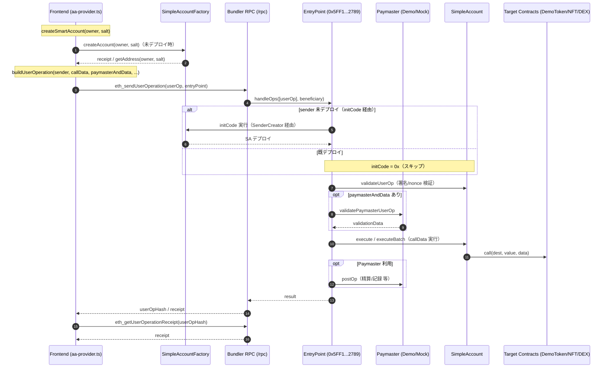

# learning.md — このリポジトリでの UserOperation データフローまとめ（Factory / Paymaster 含む）

このドキュメントは、当リポジトリにおける Account Abstraction（ERC‑4337）構成と、UserOperation のエンドツーエンドな流れ（Factory と Paymaster を含む）を、実装ファイルへ紐付けて解説します。

## 全体像（構成要素）

- EntryPoint（標準実装を使用）
  - アドレス: `0x5FF137D4b0FDCD49DcA30c7CF57E578a026d2789`
  - 役割: UserOperation の検証・実行・精算の中核
  - 参照コード: `bundler/submodules/account-abstraction/contracts/core/EntryPoint.sol`
- Smart Account（SimpleAccount）
  - 役割: 署名検証・`execute`/`executeBatch` による実行
  - ファイル: `packages/contracts/contracts/account/SimpleAccount.sol`
- Factory（SimpleAccountFactory）
  - 役割: CREATE2 + UUPS Proxy でアカウントをデプロイ / 予測アドレス算出
  - ファイル: `packages/contracts/contracts/account/SimpleAccountFactory.sol`
- Paymaster（2 種）
  - DemoPaymaster（BasePaymaster 継承・本筋に近い）: `packages/contracts/contracts/paymaster/DemoPaymaster.sol`
  - MockPaymaster（超簡易版・デモ向け）: `packages/contracts/contracts/paymaster/MockPaymaster.sol`
- Bundler（eth-infinitism）
  - 役割: UserOperation を受け取り、Validation→`handleOps` 送出
  - 主要 RPC: `eth_sendUserOperation`, `eth_getUserOperationReceipt`
  - ルート: `bundler/`（サブモジュール/パッケージ群）
- フロントエンド統合
  - 役割: アカウント生成、UserOperation 構築/送信、履歴取得
  - 主要実装: `packages/frontend/src/services/aa-provider.ts`

## UserOperation のデータフロー（標準）

1) 準備（アカウント有無の分岐）
- 未デプロイの場合
  - `initCode = <factoryAddress> + createAccount(owner, salt)` を組み立て、EntryPoint が内部で SenderCreator 経由デプロイ
  - 本リポジトリでは、フロント側は「直接 Factory を呼んで先にデプロイ」するパスを採用（詳細は下記）
- 既デプロイの場合
  - `initCode = 0x`（空）

2) UserOperation 構築
- 必須フィールド例
  - `sender`: Smart Account アドレス
  - `nonce`: Smart Account のノンス（`getNonce()` 等）
  - `callData`: Smart Account の `execute(...)`/`executeBatch(...)` 経由で行いたい実行の ABI エンコード
  - `paymasterAndData`: Paymaster を使う場合はアドレスや追加データ
  - `signature`: 署名（単一署名の場合は ECDSA）

3) Bundler へ送信
- `eth_sendUserOperation([userOp, entryPoint])` を叩く
- Bundler は `EntryPoint.simulateValidation` 等で事前検証後、`handleOps` でオンチェーン実行

4) EntryPoint での Validation フェーズ
- アカウント未デプロイなら `initCode` を実行してデプロイ
- `validateUserOp`（SimpleAccount → `_validateSignature`）で署名検証
- `paymasterAndData` がある場合は `validatePaymasterUserOp`（DemoPaymaster など）を実行

5) Execution フェーズ
- `callData` に従い Smart Account の `execute/executeBatch` がターゲットコントラクトへ delegate（外部呼び出し）

6) PostOp/精算
- Paymaster 利用時は `postOp` でガス精算/記録など（DemoPaymaster は簡易で postOp 省略）
- リファレンス: `bundler/submodules/account-abstraction/contracts/core/BasePaymaster.sol`

## このリポジトリでの具体的な実装と紐付け

- Smart Account 実装
  - `packages/contracts/contracts/account/SimpleAccount.sol`
    - ECDSA 署名検証（`_validateSignature`）
    - エントリポイント参照（`entryPoint()`）
    - 実行口（`execute`, `executeBatch`）
- Factory 実装
  - `packages/contracts/contracts/account/SimpleAccountFactory.sol`
    - `createAccount(owner, salt)` で `ERC1967Proxy` を CREATE2 デプロイ
    - `getAddress(owner, salt)` でカウンターファクチュアルアドレス計算
- Paymaster 実装
  - DemoPaymaster: `packages/contracts/contracts/paymaster/DemoPaymaster.sol`
    - `BasePaymaster` 継承、`_validatePaymasterUserOp` で簡易ホワイトリスト判定
  - MockPaymaster: `packages/contracts/contracts/paymaster/MockPaymaster.sol`
    - シンプルなデポジット/ホワイトリスト管理のみ（EntryPoint 連携は最小限）
- エコシステム（コア）参照
  - `bundler/submodules/account-abstraction/contracts/core/EntryPoint.sol`
  - `bundler/submodules/account-abstraction/contracts/core/BaseAccount.sol`
  - `bundler/submodules/account-abstraction/contracts/core/BasePaymaster.sol`

## フロントエンドから見たフロー（本リポジトリの動き）

- 実装: `packages/frontend/src/services/aa-provider.ts`
  - アカウント作成
    - `createSmartAccount(owner, salt)`
      - まず Factory の `getAddress` で予測アドレスを算出
      - アカウント未デプロイなら、ブラウザ署名者経由で Factory の `createAccount` を直接実行して「先に」デプロイ
      - 備考: これは「initCode での遅延デプロイ」ではなく、明示的に先出しデプロイする設計
  - UserOperation 構築/送信
    - `sendUserOperation(userOpPartial)` → `buildUserOperation` で `nonce / callData / gas / paymasterAndData` を整形
    - Bundler のエンドポイント（既定 `http://localhost:3000/rpc`）へ `eth_sendUserOperation`
    - 失敗時フォールバックとして、`execute(...)` を直接 EOA 実行するデモパスも同梱
  - アドレスの取得
    - デプロイ結果は `packages/contracts/deployments/latest-localhost.json` を UI で読み込み（フォールバック値あり）

## デプロイ/実行の流れ（ローカル）

- スクリプトと設定
  - ルート `package.json` の主要スクリプト
    - `npm run start:node`（Hardhat ノード）
    - `npm run deploy:local`（コントラクト一式のデプロイ）
    - `npm run start:bundler`（Bundler 起動）
    - `npm run dev:frontend`（フロント起動）
    - 一括起動: `npm run start:all`（待機→デプロイ→Bundler→フロント）
  - コントラクトデプロイ: `packages/contracts/scripts/deploy-simple.ts`
    - EntryPoint は標準アドレスを前提に使用
    - Factory / DemoToken / DemoNFT / SimpleDEX / MockPaymaster をデプロイ
    - 結果保存: `packages/contracts/deployments/latest-<network>.json`
  - デモ初期化: `packages/contracts/scripts/setup-demo.ts`
    - トークン配布、DEX プール作成、NFT 価格設定、Paymaster へのデポジット/ホワイトリストなど（DemoPaymaster を想定）

- 主要アドレス例（最新ローカル）
  - `packages/contracts/deployments/latest-localhost.json`
    - `entryPoint`: `0x5FF1...2789`
    - `accountFactory`: 例 `0x5FbD...0aa3`
    - `mockPaymaster`: 例 `0xDc64...F6C9`

## 典型シーケンス（既デプロイ・Paymaster 利用あり）

1. フロントが `sender`（Smart Account）と `callData` を用意
2. `buildUserOperation` で `nonce` や `paymasterAndData` をセット
3. `eth_sendUserOperation([userOp, entryPoint])` を Bundler に送信
4. Bundler が EntryPoint で Validation（署名・Paymaster）を検証
5. EntryPoint が `callData` 経由で Smart Account の `execute/executeBatch` を実行
6. 必要なら Paymaster の `postOp` で精算
7. `eth_getUserOperationReceipt` で結果取得 → UI 更新

## 典型シーケンス（未デプロイ・Factory 経由）

- 本実装は「initCode での遅延デプロイ」ではなく、フロントが Factory を直接呼んで先にデプロイします。
  - `createSmartAccount` → Factory `createAccount(owner, salt)` 実行
  - コード配置が確認できたら `initCode = 0x` で通常の UserOperation を送信
- 参考: initCode シナリオを採る場合は、`userOp.initCode = factory.address ++ createAccount(owner, salt)` を組み立てます

## Paymaster の使い方（このリポジトリ）

- DemoPaymaster
  - `validatePaymasterUserOp` でホワイトリストを確認
  - `depositFor(address)` による簡易チャージ機構
  - エントリポイントのデポジット・ステーク処理は簡素化
- MockPaymaster
  - エントリポイントと連携しない軽量デモ。フロントのデフォルト参照は `mockPaymaster`
- フロント側の `paymasterAndData`
  - 現状は「アドレス + パディング」の簡易形（`aa-provider.ts` 内）。本番では署名/有効期限等のエンコードが必要

## 実装ファイル早見表

- アカウント/Factory
  - `packages/contracts/contracts/account/SimpleAccount.sol`
  - `packages/contracts/contracts/account/SimpleAccountFactory.sol`
- Paymaster
  - `packages/contracts/contracts/paymaster/DemoPaymaster.sol`
  - `packages/contracts/contracts/paymaster/MockPaymaster.sol`
- コア（参照）
  - `bundler/submodules/account-abstraction/contracts/core/EntryPoint.sol`
  - `bundler/submodules/account-abstraction/contracts/core/BasePaymaster.sol`
  - `bundler/submodules/account-abstraction/contracts/core/BaseAccount.sol`
- デプロイ/セットアップ
  - `packages/contracts/scripts/deploy-simple.ts`
  - `packages/contracts/scripts/setup-demo.ts`
  - 出力: `packages/contracts/deployments/latest-localhost.json` 等
- フロント統合
  - `packages/frontend/src/services/aa-provider.ts`

## 注意点（このリポジトリ特有のメモ）

- Frontend と Scripts の Paymaster 名称差
  - デプロイスクリプトは `MockPaymaster` をデプロイ、`setup-demo.ts` は `DemoPaymaster` を参照する箇所あり
  - UI の既定は `mockPaymaster` を読み込み（`aa-provider.ts`）
  - どちらを使うかを揃える場合は、デプロイ/読込の整合性をとってください
- initCode デプロイ vs 先出しデプロイ
  - 現状は「先に Factory で作成」→ `initCode=0x` で送るパス
  - 4337 らしい体験（EOA ガスレス初回）を強めたい場合は initCode パス実装を追加
- `paymasterAndData` の簡略化
  - 本番運用では署名・期限・ポリシー等をエンコードし、`validatePaymasterUserOp`/`postOp` と連携が必要

---

このドキュメントは、当リポジトリの学習・改修の出発点です。必要に応じて、具体的な送信パラメータ例・ガス計測・失敗時のトラブルシュートを追記してください。

## Mermaid 図（シーケンス / アーキテクチャ）

### シーケンス（本リポジトリの実動パス：Factory 先出し→UserOperation）



補足:
- 本リポジトリは「Factory で先にデプロイ」→ `initCode=0x` の経路をデフォルト採用（`aa-provider.ts`）。
- initCode デプロイを採る場合は、UserOperation の `initCode` に `factory.createAccount(owner, salt)` 呼び出しデータを組み込みます。

### アーキテクチャ（コンポーネント関連）

```mermaid
graph TD
    subgraph Frontend
        FE[aa-provider.ts]
    end
    subgraph Contracts
        SA[SimpleAccount<br/>packages/contracts/contracts/account/SimpleAccount.sol]
        FAC[SimpleAccountFactory<br/>packages/contracts/contracts/account/SimpleAccountFactory.sol]
        PM[Paymaster (Demo/Mock)<br/>packages/contracts/contracts/paymaster]
        TKN[DemoToken/DemoNFT/SimpleDEX]
        EP[EntryPoint<br/>bundler/submodules/account-abstraction/contracts/core/EntryPoint.sol]
    end
    subgraph Services
        BDR[Bundler (/rpc)]
        RPC[Hardhat Node (8545)]
    end

    FE -- createAccount/getAddress --> FAC
    FAC -- CREATE2 + ERC1967Proxy --> SA
    FE -- eth_sendUserOperation --> BDR
    BDR -- handleOps --> EP
    EP -- validateUserOp/execute --> SA
    SA -- execute/executeBatch --> TKN
    EP -- validatePaymasterUserOp/postOp --> PM

    FE --- RPC
    BDR --- RPC
```

## EntryPoint の定義と配置方針

- 定義元（実装）
  - `bundler/submodules/account-abstraction/contracts/core/EntryPoint.sol`
  - Bundler と完全整合のとれた実装を使うため、bundler 配下に account-abstraction リポジトリをサブモジュールとして同梱しています。

- アプリ側の参照（IF）
  - `@account-abstraction/contracts/interfaces/IEntryPoint.sol` を npm から参照（実装はビルドしない）
  - 例: `SimpleAccount.sol` は `IEntryPoint` を参照、`SimpleAccountFactory` のコンストラクタも `IEntryPoint` を受け取ります。

- 既知アドレス（前提）
  - `0x5FF137D4b0FDCD49DcA30c7CF57E578a026d2789`
  - 参照箇所: `packages/contracts/scripts/deploy-simple.ts`、`packages/frontend/src/services/aa-provider.ts`

- なぜ bundler のサブモジュールなのか
  - Bundler の検証/シミュレーションと EntryPoint 実装のバージョンを厳密に合わせる必要があるため
  - 実装を二重管理せず、衝突や齟齬を避けるため（アプリ側は IF のみ）

- ローカルで同一アドレスを用意する方法（localhost）
  - 公開ネットでは上記アドレスが既にデプロイ済み（標準アドレス）
  - localhost では存在しないため、Create2 による決定論的デプロイで同一アドレスを確保します
  - サブモジュールのデプロイスクリプトを利用する例:

    ```bash
    # Terminal 1: Hardhat ノード
    npm run start:node

    # Terminal 2: account-abstraction サブモジュールから EntryPoint をデプロイ
    cd bundler/submodules/account-abstraction
    npm install
    npx hardhat run deploy/1_deploy_entrypoint.ts --network localhost
    ```

  - デプロイ後、`0x5FF1...2789` にコードが載っていることを `eth_getCode` などで確認してください
  - もし別アドレスを使う場合は、`deploy-simple.ts` と `aa-provider.ts` の定数も更新が必要です
