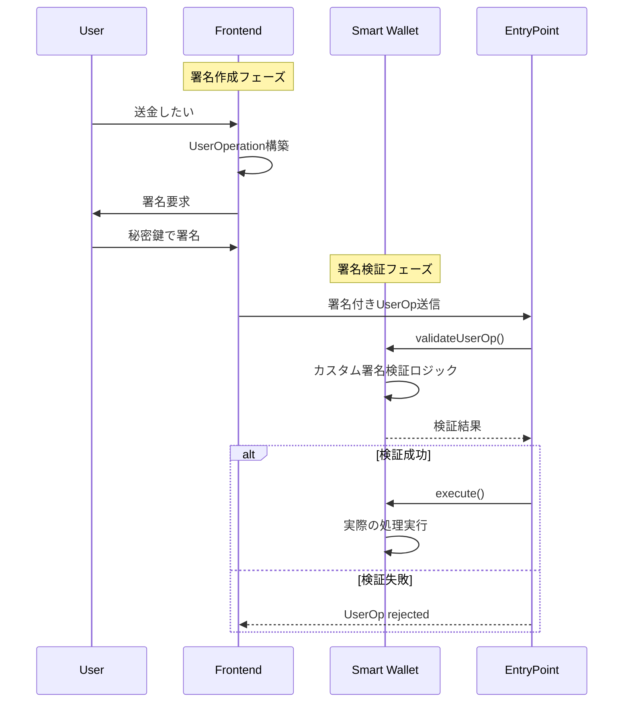

# Smart Contract Wallet の署名メカニズム

## 基本原理：署名と検証の分離

Smart Contract Walletでは**署名作成**と**署名検証**が完全に分離されているのだ。

### 署名作成（オフチェーン）
```typescript
// フロントエンドでの署名作成例
async function signUserOperation(userOp: UserOperation, privateKey: string) {
    const userOpHash = await getUserOpHash(userOp);
    
    // 1. 単一署名の場合
    const signature = await ethers.utils.signing.signMessage(userOpHash, privateKey);
    
    // 2. マルチシグの場合
    const signatures = await Promise.all([
        signer1.signMessage(userOpHash),
        signer2.signMessage(userOpHash),
        signer3.signMessage(userOpHash)
    ]);
    const combinedSignature = combineSignatures(signatures);
    
    return signature; // または combinedSignature
}
```

### 署名検証（オンチェーン）
```solidity
// Smart Contract Wallet での署名検証
contract SimpleAccount is BaseAccount {
    address public owner;
    
    function validateUserOp(
        UserOperation calldata userOp,
        bytes32 userOpHash,
        uint256 missingAccountFunds
    ) external override returns (uint256 validationData) {
        
        // 1. 署名検証のカスタムロジック
        bytes32 hash = userOpHash.toEthSignedMessageHash();
        
        if (owner != hash.recover(userOp.signature)) {
            return SIG_VALIDATION_FAILED;
        }
        
        // 2. その他の検証（nonce、ガス代等）
        // ...
        
        return 0; // 検証成功
    }
}
```

## 署名方式の柔軟性

### 1. 単一署名（ECDSA）
```solidity
function validateUserOp(...) {
    bytes32 hash = userOpHash.toEthSignedMessageHash();
    address recovered = hash.recover(userOp.signature);
    
    if (recovered != owner) {
        return SIG_VALIDATION_FAILED;
    }
}
```

### 2. マルチシグ
```solidity
mapping(address => bool) public owners;
uint256 public required; // 必要な署名数

function validateUserOp(...) {
    bytes[] memory signatures = parseSignatures(userOp.signature);
    uint256 validSignatures = 0;
    
    for (uint i = 0; i < signatures.length; i++) {
        address signer = recoverSigner(userOpHash, signatures[i]);
        if (owners[signer]) {
            validSignatures++;
        }
    }
    
    if (validSignatures >= required) {
        return 0; // 成功
    }
    return SIG_VALIDATION_FAILED;
}
```

### 3. ソーシャルリカバリー
```solidity
mapping(address => bool) public guardians;
uint256 public recoveryThreshold;

function validateUserOp(...) {
    // 通常のowner署名チェック
    if (isValidOwnerSignature(userOpHash, userOp.signature)) {
        return 0;
    }
    
    // ガーディアン署名による緊急実行
    if (isValidGuardianSignatures(userOpHash, userOp.signature)) {
        return 0;
    }
    
    return SIG_VALIDATION_FAILED;
}
```

### 4. 時間ベース・条件付き署名
```solidity
struct Timelock {
    uint256 executeAfter;
    bytes32 operationHash;
}

function validateUserOp(...) {
    // 即座実行可能な操作（小額送金等）
    if (isSmallTransaction(userOp) && isValidOwnerSignature(...)) {
        return 0;
    }
    
    // 大額取引は時間ロック
    if (isLargeTransaction(userOp)) {
        Timelock storage timelock = timelocks[userOpHash];
        if (block.timestamp >= timelock.executeAfter) {
            return 0;
        }
        return SIG_VALIDATION_FAILED;
    }
}
```

## フロー全体図



## 利点

### 1. 柔軟性
- **署名方式の自由度**: ECDSA, マルチシグ, 生体認証等
- **条件付き実行**: 時間、金額、宛先による制限
- **アップグレード可能**: 新しい認証方式への対応

### 2. セキュリティ
- **カスタムルール**: ビジネスロジックに応じた認証
- **リカバリ機能**: ソーシャルリカバリー、ガーディアン
- **段階的認証**: リスクに応じた認証強度

### 3. ユーザビリティ  
- **鍵管理の改善**: 複数の認証手段
- **復旧オプション**: 秘密鍵紛失時の対応
- **バッチ処理**: 複数操作の一括実行

## 学習での実装順序

1. **基本的な単一署名**: ECDSA署名の検証
2. **マルチシグ**: 複数署名の組み合わせ
3. **時間ロック**: 条件付き実行
4. **ソーシャルリカバリー**: ガーディアンシステム
5. **高度な機能**: 生体認証、MFA等