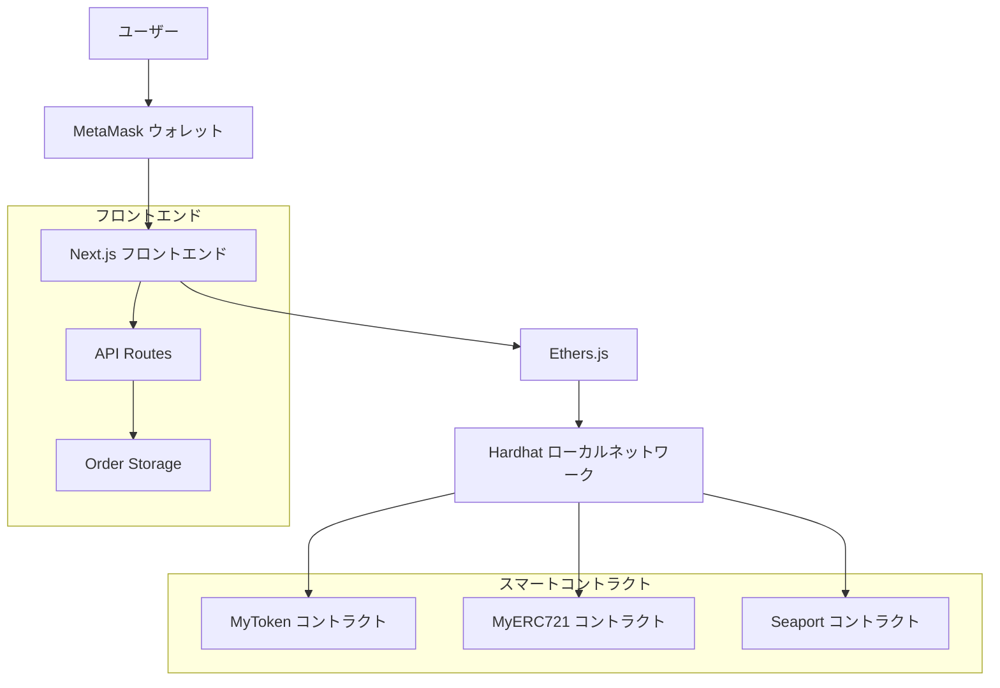
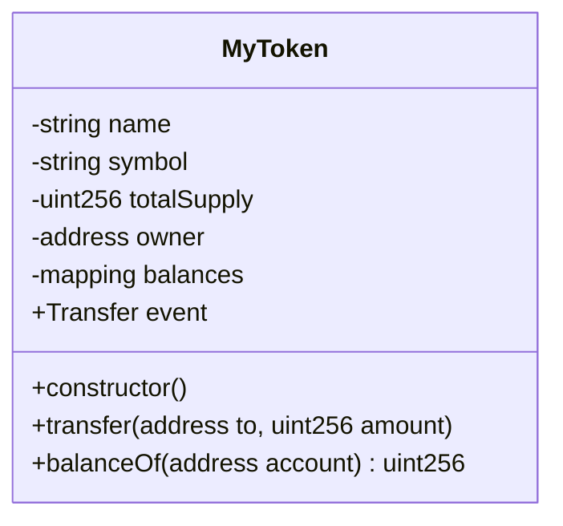
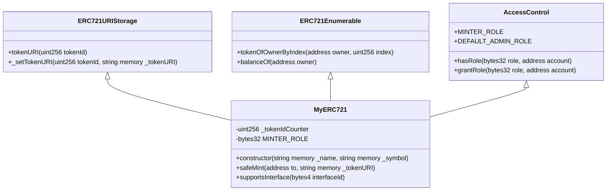
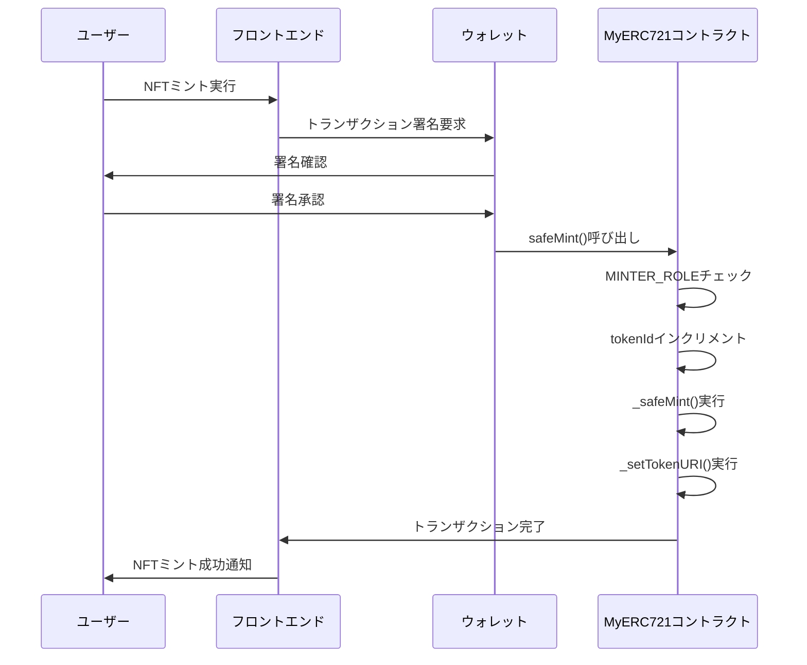
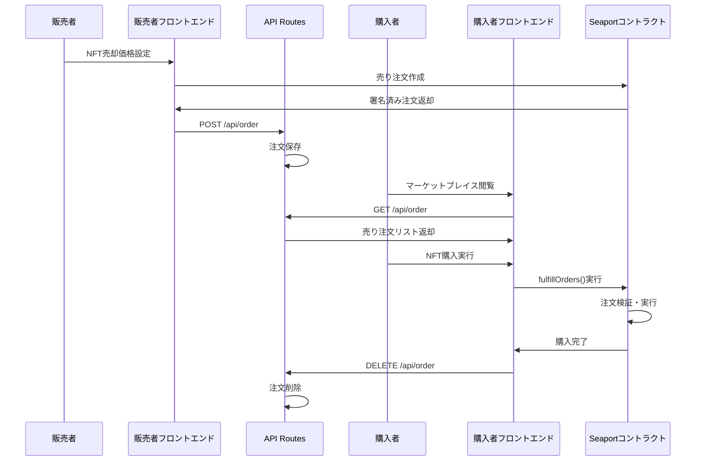
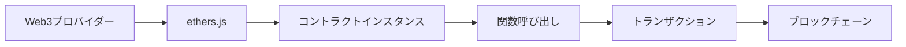

# ブロックチェーンアプリ - Web3 NFT マーケットプレイス

ERC20 と ERC721 トークンコントラクトを使用し、Seaport プロトコルを利用した NFT のミント、取引、管理機能を持つ Next.js フロントエンドを備えたフルスタックブロックチェーンアプリケーション。

## アーキテクチャ

### システム全体図



### スマートコントラクト

- **MyToken.sol** - カスタム ERC20 類似トークン実装
- **MyERC20.sol** - OpenZeppelin を使用した標準 ERC20 トークン
- **MyERC721.sol** - ロールベースアクセス制御を持つ高度な NFT コントラクト
- **Seaport 統合** - NFT マーケットプレイス機能

### フロントエンド

- **Next.js 13** - TypeScript を使用した App Router
- **Mantine UI** - モダンな React コンポーネント
- **Ethers.js v6** - Ethereum との相互作用
- **Web3 Context** - グローバルウォレット状態管理

## 機能

### トークン管理

- ERC20 トークン残高の確認
- ウォレット連携による新規トークンミント

### NFT 操作

- **NFT ミント** - メタデータ付き NFT の作成
- **コレクション表示** - 所有 NFT のメタデータ付き表示
- **NFT 販売** - マーケットプレイスでの NFT 出品
- **NFT 購入** - 他ユーザーからの NFT 購入

### マーケットプレイス

- Seaport ベースの NFT 取引
- 注文作成と約定
- ETH での価格設定

## 技術スタック

### スマートコントラクト

- **Solidity** 0.8.19 & 0.8.17
- **Hardhat** - 開発環境
- **OpenZeppelin** - セキュリティ監査済みコントラクト
- **Seaport** - NFT マーケットプレイスプロトコル

### フロントエンド

- **Next.js** 13.4.13
- **React** 18.2.0
- **TypeScript** 5.8.3
- **Mantine** 7.0.0
- **Ethers.js** 6.7.0

## セットアップ

### 前提条件

- Node.js 18+
- npm または yarn
- MetaMask または互換性のあるウォレット

### インストール

1. **リポジトリのクローンと依存関係のインストール**

```bash
git clone <repository>
cd blockchainApp
npm install
cd frontend && npm install
```

2. **コントラクトのコンパイル**

```bash
npx hardhat compile
```

3. **ローカル環境でのコントラクトデプロイ**

```bash
npx hardhat node
npx hardhat run scripts/deploy.ts --network localhost
```

4. **コントラクトアドレスの更新**
   フロントエンドコンポーネントのコントラクトアドレスを更新：

- `frontend/app/page.tsx` - MyToken コントラクト
- `frontend/app/mynft/page.tsx` - MyERC721 コントラクト
- `frontend/app/order/page.tsx` - Seaport コントラクト

5. **フロントエンドの起動**

```bash
cd frontend
npm run dev
```

## コントラクト詳細

### MyToken コントラクト

- **名前**: MyToken (MYT)
- **供給量**: 1,000,000 トークン
- **機能**: 転送、残高確認
- **場所**: `contracts/MyToken.sol`

#### MyToken コントラクトの構造



### MyERC721 コントラクト

- **機能**:
  - ロールベースアクセス制御（MINTER_ROLE）
  - メタデータの URI 保存
  - オーナー追跡のための列挙可能
  - 自動インクリメント tokenId での安全なミント
- **場所**: `contracts/MyERC721.sol`

#### MyERC721 コントラクトの継承構造



### NFT ミントフロー



## フロントエンドページ

### ホーム (`/`)

- ウォレット接続
- MyToken 残高表示
- 基本的な Web3 連携

### My NFTs (`/mynft`)

- 新規 NFT ミント
- 所有 NFT コレクション表示
- NFT 販売出品
- Seaport 統合

### マーケットプレイス (`/order`)

- 全販売注文の表示
- NFT 購入
- 注文管理

## API ルート

### `/api/order`

- **GET** - 全販売注文の取得
- **POST** - 新規販売注文の作成
- **DELETE** - 完了した注文の削除

### NFT 売買フロー



## 開発

### コントラクトテスト

```bash
npx hardhat test
```

### フロントエンド開発

```bash
cd frontend
npm run dev
```

### 型生成

TypeChain が自動的にコントラクトの TypeScript 型を`frontend/types/`に生成

## 設定

### Hardhat 設定

- Solidity バージョン: 0.8.19, 0.8.17
- TypeChain 出力: `frontend/types`
- Seaport 向け最適化有効

### ネットワーク設定

- デフォルト: Hardhat ローカルネットワーク
- ポート: 8545
- チェーン ID: 31337

## セキュリティ考慮事項

- NFT ミントのロールベースアクセス制御
- 安全な転送メカニズム
- フロントエンドでの入力検証
- コントラクトアドレスのハードコード（本番環境では更新必要）

## 既知の制限事項

- NFT 表示にダミーメタデータを使用
- 販売注文のローカル保存（本番環境ではデータベース使用推奨）
- ハードコードされたコントラクトアドレス
- 永続的なオーダーブックなし
- Seaport.js は ethers v5 を使用（互換性レイヤーを含む）

## デプロイメント

1. フロントエンドのコントラクトアドレス更新
2. 本番ネットワークへのデプロイ
3. 環境変数の設定
4. 適切なメタデータストレージの設定（IPFS 推奨）
5. 適切な注文保存バックエンドの実装

## Web3 学習のポイント

### 1. スマートコントラクトの基本概念

- **状態変数**: ブロックチェーン上に永続化されるデータ
- **関数**: 状態を変更する（state-changing）か読み取り専用（view/pure）
- **イベント**: フロントエンドが監視可能なログ
- **修飾子**: 関数実行前の条件チェック

### 2. ERC 標準の理解

- **ERC20**: 代替可能トークン（Fungible Token）
- **ERC721**: 非代替可能トークン（Non-Fungible Token）
- **ERC1155**: マルチトークン標準

### 3. ガス（Gas）の概念

- **ガス料金**: トランザクション実行コスト
- **ガス制限**: トランザクションが消費可能な最大ガス量
- **最適化**: 不要な処理を減らしガス効率を向上

### 4. セキュリティのベストプラクティス

- **アクセス制御**: 適切な権限管理
- **リエントランシー攻撃**: 外部呼び出し時の状態管理
- **整数オーバーフロー**: SafeMath や Solidity 0.8+の活用

### 5. フロントエンドとの連携



### 6. 開発環境の理解

- **Hardhat**: ローカル開発・テスト環境
- **TypeChain**: TypeScript 型自動生成
- **OpenZeppelin**: セキュリティ監査済みライブラリ
- **MetaMask**: ブラウザウォレット

### 7. 学習リソース

- [Ethereum 公式ドキュメント](https://ethereum.org/en/developers/docs/)
- [OpenZeppelin Contracts](https://docs.openzeppelin.com/contracts/)
- [Hardhat Tutorial](https://hardhat.org/tutorial/)
- [ethers.js Documentation](https://docs.ethers.io/)

## 貢献

1. 既存のコードスタイルに従う
2. 新機能にテストを追加
3. ドキュメントを更新
4. セキュリティベストプラクティスを確保
