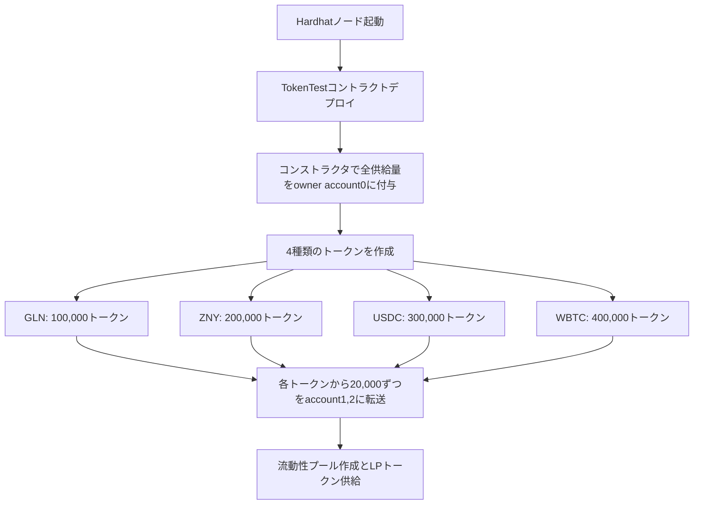
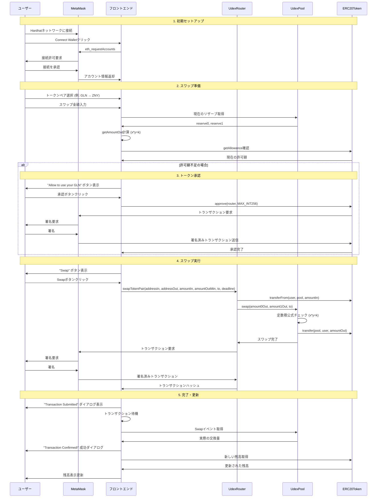

# Udex - 分散型取引所

SolidityスマートコントラクトとNext.jsフロントエンドで構築された、Uniswap V2プロトコルアーキテクチャに基づくフルスタック分散型取引所（DEX）の実装です。

## アーキテクチャ概要

### スマートコントラクト

#### コアコントラクト

- **UdexFactory** (`hardhat/contracts/UdexFactory.sol`): 流動性プールを作成するファクトリーコントラクト
  - CREATE2を使用してトークンペアのプールを作成し、決定論的アドレスを生成
  - トークンペアからプールアドレスへのマッピングを管理
  - 新しいプールに対して`PoolCreated`イベントを発行

- **UdexPool** (`hardhat/contracts/UdexPool.sol`): AMM流動性プールの実装
  - LPトークン機能のためにUdexERC20を継承
  - 定数積公式 (x * y = k) を実装
  - 流動性トークンのミント/バーンを処理
  - 0.3%の手数料でトークンスワップを実行
  - 価格計算のためにリザーブを維持

- **UdexRouter** (`hardhat/contracts/UdexRouter.sol`): ユーザーインタラクションのエントリーポイント
  - スリッページ保護付きの流動性追加/削除を処理
  - プールを通じてトークンスワップを実行
  - トランザクションのデッドライン保護を含む
  - 流動性提供のための最適な金額を計算

- **UdexERC20** (`hardhat/contracts/UdexERC20.sol`): LPトークンのERC20実装

#### サポートコンポーネント

- **Math Library** (`hardhat/contracts/libraries/Math.sol`): 平方根計算
- **UdexLibrary** (`hardhat/contracts/libraries/UdexLibrary.sol`): 価格と金額の計算
- **IERC20 Interface** (`hardhat/contracts/interfaces/IERC20.sol`): トークンインターフェース

### フロントエンドアプリケーション

#### コアコンポーネント

- **ChainContext** (`src/components/ChainContext.tsx`): Web3プロバイダー統合とブロックチェーン状態管理
- **Swap** (`src/components/Swap.tsx`): スリッページ処理付きトークンスワップインターフェース
- **Pool** (`src/components/Pool.tsx`): 流動性プール管理インターフェース
- **AddLiquidityDialog** (`src/components/AddLiquidityDialog.tsx`): 流動性追加用モーダル
- **TokenCombobox** (`src/components/TokenCombobox.tsx`): トークン選択ドロップダウン
- **TxDialog** (`src/components/TxDialog.tsx`): トランザクション状態ダイアログ

#### ページ

- **Swap Page** (`src/pages/swap.tsx`): トークン取引インターフェース
- **Pool Page** (`src/pages/pool.tsx`): 流動性管理インターフェース
- **Home Page** (`src/pages/index.tsx`): ランディングページ

#### ユーティリティ

- **Load Module** (`src/lib/load.ts`): チェーンとトークンデータの読み込み
- **Utilities** (`src/lib/utilities.ts`): AMM計算とヘルパー

## 技術スタック

### ブロックチェーン
- **Solidity** 0.8.17
- **Hardhat** 開発とテスト用
- **Ethers.js** v5.7.2 ブロックチェーンインタラクション用

### フロントエンド
- **Next.js** 13.2.1 (Reactフレームワーク)
- **TypeScript** 型安全性のため
- **Tailwind CSS** スタイリング用
- **Headless UI** アクセシブルなコンポーネント用
- **Heroicons** アイコン用

### 開発ツール
- **MetaMask** ウォレット接続統合
- **ESLint** コード品質管理
- **PostCSS** CSS処理

## セットアップと開発

### 前提条件
- Node.js (v16+ 推奨、v22でも動作確認済み)
- npm または yarn
- MetaMaskブラウザ拡張機能

⚠️ **注意**: Hardhatは現在Node.js v22を正式サポートしていませんが、動作に問題はありません。

### インストール

1. **依存関係のインストール:**
   ```bash
   npm run ci-and-compile
   ```

2. **ローカルブロックチェーンの起動:**
   ```bash
   npm run test-node
   ```
   このコマンドは以下を実行します：
   - Hardhatローカルノードを起動
   - テストデータでコントラクトをデプロイ
   - 初期流動性でトークンペアを作成

3. **フロントエンド開発サーバーの起動:**
   ```bash
   npm run dev
   ```

4. **MetaMaskの設定:**
   
   **ローカルネットワークの追加:**
   - MetaMaskを開く → ネットワーク選択 → "ネットワークの追加" → "ネットワークを手動で追加"
   - 以下の設定を入力：
     - ネットワーク名: `Hardhat Local`
     - 新しいRPC URL: `http://127.0.0.1:8545`
     - チェーンID: `31337`
     - 通貨記号: `ETH`
   
   **テストアカウントのインポート:**
   - MetaMask → アカウント → "アカウントをインポート"
   - 以下のテストアカウント秘密鍵を使用（各10,000 ETH）：
     ```
     Account #0: 0xac0974bec39a17e36ba4a6b4d238ff944bacb478cbed5efcae784d7bf4f2ff80
     Account #1: 0x59c6995e998f97a5a0044966f0945389dc9e86dae88c7a8412f4603b6b78690d
     Account #2: 0x5de4111afa1a4b94908f83103eb1f1706367c2e68ca870fc3fb9a804cdab365a
     ```

5. **テストデータのデプロイ:**
   ```bash
   cd hardhat
   npx hardhat run --network localhost scripts/deployTestFixture.ts
   ```
   このスクリプトは以下をデプロイします：
   - UdexFactory、UdexRouterコントラクト
   - テストトークン（GLN、ZNY、USDC、WBTC）
   - 各トークンペアの初期流動性

### 利用可能なスクリプト

#### ルートパッケージ
- `npm run dev` - Next.js開発サーバーを起動
- `npm run build` - プロダクションアプリケーションをビルド
- `npm run start` - プロダクションサーバーを起動
- `npm run lint` - ESLintを実行
- `npm run ci-and-compile` - 依存関係をインストールしてコントラクトをコンパイル
- `npm run clean` - すべてのnode_modulesをクリーン
- `npm run test-node` - テストデータでローカルブロックチェーンを起動

#### Hardhatパッケージ
- `npm run compile --prefix hardhat` - スマートコントラクトをコンパイル
- `npm run clean --prefix hardhat` - Hardhatアーティファクトをクリーン

## コントラクトデプロイメント

デプロイメントスクリプト (`hardhat/scripts/deployTestFixture.ts`) は以下をセットアップします：

1. **コアコントラクト:**
   - UdexFactory: `0x5FbDB2315678afecb367f032d93F642f64180aa3`
   - UdexRouter: `0xe7f1725E7734CE288F8367e1Bb143E90bb3F0512`

2. **テストトークン:**
   - GLN (Galleon): `0x9fE46736679d2D9a65F0992F2272dE9f3c7fa6e0`
   - ZNY (Zenny): `0xCf7Ed3AccA5a467e9e704C703E8D87F634fB0Fc9`
   - USDC: `0xDc64a140Aa3E981100a9becA4E685f962f0cF6C9`
   - WBTC: `0x5FC8d32690cc91D4c39d9d3abcBD16989F875707`

3. **初期流動性:** 各アカウントが20,000トークンを受け取り、プールに流動性を提供

## トークン発行とSwap全体フロー

### 1. トークン発行の仕組み

初期トークンは`deployTestFixture.ts`スクリプトで発行されます：



### 2. DEXスワップまでの全体フロー



### 3. トークン発行の詳細

**TokenTestコントラクト構造:**
- `constructor`: デプロイ時に全供給量を`msg.sender`（deployer）に付与
- `_owner = msg.sender`: コントラクトデプロイヤーが初期所有者
- `_balances[_owner] = _totalSupply`: 全トークンを初期所有者の残高に設定

**deployTestFixture.tsでの配布:**
1. `account0`（deployer）が全トークンを受け取る
2. `account0`から`account1`, `account2`に各20,000トークンを転送
3. 各アカウントが流動性プールに1,000+2,000トークンずつ提供

## 主要機能

### AMM機能
- 定数積マーケットメーカー (x * y = k)
- 流動性プロバイダーに分配される0.3%のスワップ手数料
- 最小出力金額によるスリッページ保護
- 時間制限のあるトランザクションのデッドライン保護

### 流動性管理
- 自動価格計算による流動性の追加/削除
- ポジション追跡のためのLPトークンミント/バーン
- 操作に対する最小流動性保護

### ユーザーインターフェース
- リアルタイム価格計算
- トークン残高表示
- トランザクション状態追跡
- トークン許可のための承認フロー
- Tailwind CSSを使用したレスポンシブデザイン

### セキュリティ機能
- 重要な関数での再入攻撃保護
- 入力検証とエラーハンドリング
- トークン計算のための安全な数学演算
- プール初期化のアクセス制御

## 設定

### チェーンデータ (`data/chains.json`)
異なるブロックチェーンネットワークのネットワーク設定

### トークンデータ (`data/tokens.json`)
シンボル、小数点以下桁数、アドレスを含むトークンメタデータ

### コントラクトデータ (`data/contracts.json`)
異なるネットワークのデプロイ済みコントラクトアドレス

## テスト

プロジェクトには包括的なテストスイートが含まれています：
- 数学関数のユニットテスト (`hardhat/test/MathTest.ts`)
- ファクトリー、プール、ルーターコントラクトの統合テスト
- ライブラリ関数テスト (`hardhat/test/UdexLibraryTest.ts`)

テストの実行：
```bash
cd hardhat && npx hardhat test
```

## 開発ノート

### 価格計算
価格は定数積公式を使用して計算され、手数料を考慮した後にリザーブが不変量 `reserve0 * reserve1 = k` を維持します。

### トークン順序
トークンは一貫してアドレス（昇順）で順序付けされ、決定論的なプールアドレスと計算を確保します。

### ガス最適化
- 可能な限りバッチ操作を実行
- コントラクトでの効率的なストレージパターン
- クリティカルパスでの外部呼び出しを最小化

## 使用方法

### DEXの操作手順

1. **アプリケーションアクセス**
   - ブラウザで http://localhost:3000 を開く
   - MetaMaskで「Hardhat Local」ネットワークに切り替え

2. **ウォレット接続**
   - 「Connect Wallet」ボタンをクリック
   - MetaMaskで接続を承認

3. **トークンスワップ**
   - Swapページでトークンペアを選択
   - 交換したい金額を入力
   - 必要に応じてトークン承認を実行
   - 「Swap」ボタンでトランザクション実行

4. **流動性提供**
   - Poolページで「Add Liquidity」をクリック
   - トークンペアと金額を選択
   - トークン承認後、流動性を追加

### トラブルシューティング

**MetaMaskが接続できない場合:**
- ネットワーク設定を確認（チェーンID: 31337）
- アカウントの秘密鍵が正しくインポートされているか確認
- ブラウザの拡張機能が有効になっているか確認

**トークンが表示されない場合:**
- テストデータのデプロイが完了しているか確認
- MetaMaskでカスタムトークンを追加

**トランザクションが失敗する場合:**
- ガス代が十分にあるか確認
- トークンの承認が必要な場合は事前に実行
- Hardhatノードが正常に動作しているか確認

このDEX実装は、AMM仕組みを理解するための堅実な基盤を提供し、フラッシュローン、ガバナンストークン、マルチホップルーティングなどの追加機能で拡張できます。