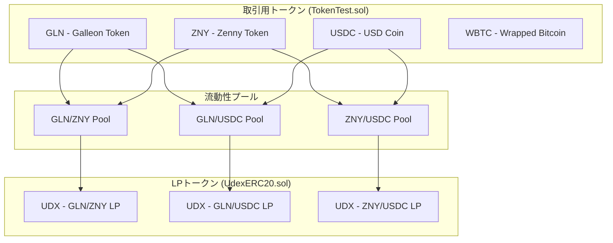
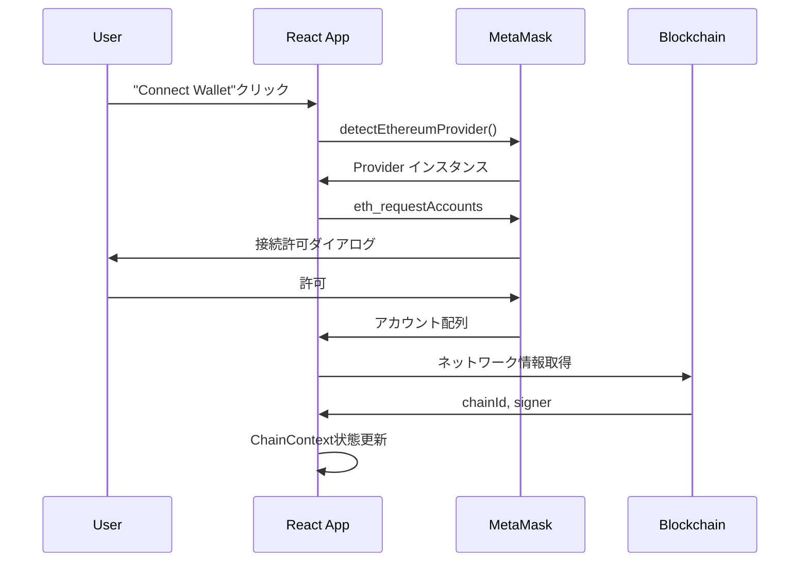
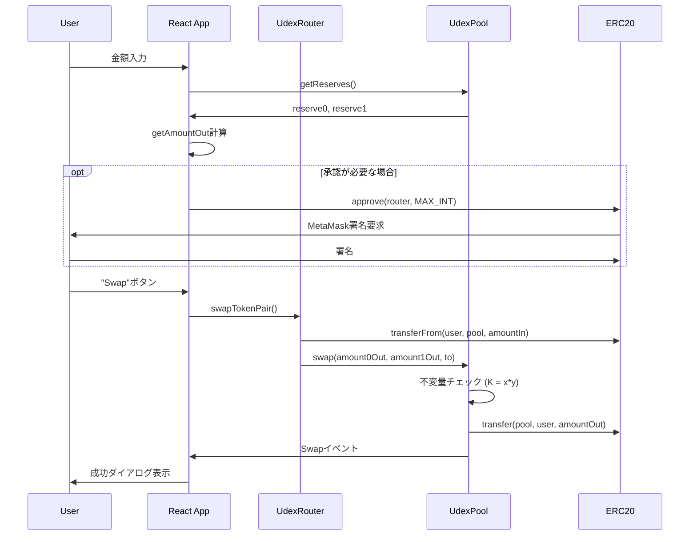

# Udex DEX - 包括的技術ドキュメント

このドキュメントは、Udex分散型取引所の完全な技術的理解を提供します。Uniswap V2アーキテクチャをベースとした、SolidityスマートコントラクトとNext.jsフロントエンドによる本格的なDEX実装です。

## 目次

1. [アーキテクチャ概要](#アーキテクチャ概要)
2. [スマートコントラクト詳細分析](#スマートコントラクト詳細分析)
3. [フロントエンドアーキテクチャ](#フロントエンドアーキテクチャ)
4. [データフローとインタラクション](#データフローとインタラクション)
5. [設定とデプロイメント](#設定とデプロイメント)
6. [セキュリティと最適化](#セキュリティと最適化)
7. [開発ワークフロー](#開発ワークフロー)

---

## アーキテクチャ概要

### 全体構成

```
Udex DEX Architecture
├── Smart Contracts (Solidity)     # ブロックチェーン層
│   ├── Core Protocol              # AMM核心ロジック
│   ├── Libraries                  # 数学計算ユーティリティ
│   └── Test Contracts            # 開発・テスト用
├── Frontend Application (Next.js) # ユーザーインターフェース層
│   ├── Web3 Integration          # ブロックチェーン接続
│   ├── Trading Interface         # スワップ・流動性管理
│   └── State Management         # アプリケーション状態
└── Configuration & Data          # 設定・メタデータ
    ├── Network Configs           # チェーン設定
    ├── Token Registry           # トークンメタデータ
    └── Contract Addresses      # デプロイ済みアドレス
```

### 技術スタック

**ブロックチェーン層:**
- Solidity 0.8.17 (スマートコントラクト言語)
- Hardhat (開発・テスト環境)
- Ethers.js v5 (ブロックチェーン相互作用)
- OpenZeppelin (セキュリティパターン)

**フロントエンド層:**
- Next.js 13.2.1 (Reactフレームワーク)
- TypeScript (型安全性)
- Tailwind CSS (スタイリング)
- Headless UI (アクセシブルコンポーネント)

---

## スマートコントラクト詳細分析

### 核心コントラクト

#### 1. UdexFactory.sol - プール作成ファクトリー

**主要責任:**
- 流動性プールの作成と管理
- CREATE2による決定論的アドレス生成
- トークンペアとプールアドレスのマッピング

**核心実装:**

```solidity
contract UdexFactory {
    mapping(address => mapping(address => address)) public getPool;
    
    function createPool(address tokenA, address tokenB) external returns (address pool) {
        require(tokenA != tokenB, 'UdexFactory: IDENTICAL_ADDRESSES');
        (address token0, address token1) = tokenA < tokenB ? (tokenA, tokenB) : (tokenB, tokenA);
        require(getPool[token0][token1] == address(0), 'UdexFactory: POOL_EXISTS');
        
        bytes memory bytecode = type(UdexPool).creationCode;
        bytes32 salt = keccak256(abi.encodePacked(token0, token1));
        assembly {
            pool := create2(0, add(bytecode, 32), mload(bytecode), salt)
        }
        
        IUdexPool(pool).initialize(token0, token1);
        getPool[token0][token1] = pool;
        getPool[token1][token0] = pool; // populate mapping in the reverse direction
        emit PoolCreated(token0, token1, pool);
    }
}
```

**アーキテクチャ的決定:**
- **CREATE2使用**: 同じトークンペアは常に同じアドレスに生成される
- **双方向マッピング**: (A,B)と(B,A)両方向からプールを検索可能
- **トークン順序正規化**: アドレス昇順でトークンを並び替え

#### 2. UdexPool.sol - AMM流動性プール

**主要責任:**
- 定数積公式(x * y = k)の実装
- トークンスワップ実行（0.3%手数料）
- 流動性トークン（LP token）の発行・償却
- プール状態の維持

**核心AMM実装:**

```solidity
contract UdexPool is UdexERC20 {
    uint112 private reserve0;           // uses single storage slot, accessible via getReserves
    uint112 private reserve1;           // uses single storage slot, accessible via getReserves
    uint32  private blockTimestampLast; // uses single storage slot, accessible via getReserves
    
    uint public constant MINIMUM_LIQUIDITY = 10**3;
    
    function swap(uint amount0Out, uint amount1Out, address to) external nonReentrant {
        require(amount0Out > 0 || amount1Out > 0, 'UdexPool: INSUFFICIENT_OUTPUT_AMOUNT');
        (uint112 _reserve0, uint112 _reserve1,) = getReserves();
        require(amount0Out < _reserve0 && amount1Out < _reserve1, 'UdexPool: INSUFFICIENT_LIQUIDITY');

        uint balance0;
        uint balance1;
        { // scope for _token{0,1}, avoids stack too deep errors
        address _token0 = token0;
        address _token1 = token1;
        require(to != _token0 && to != _token1, 'UdexPool: INVALID_TO');
        if (amount0Out > 0) _safeTransfer(_token0, to, amount0Out); // optimistically transfer tokens
        if (amount1Out > 0) _safeTransfer(_token1, to, amount1Out); // optimistically transfer tokens
        balance0 = IERC20(_token0).balanceOf(address(this));
        balance1 = IERC20(_token1).balanceOf(address(this));
        }
        uint amount0In = balance0 > _reserve0 - amount0Out ? balance0 - (_reserve0 - amount0Out) : 0;
        uint amount1In = balance1 > _reserve1 - amount1Out ? balance1 - (_reserve1 - amount1Out) : 0;
        require(amount0In > 0 || amount1In > 0, 'UdexPool: INSUFFICIENT_INPUT_AMOUNT');
        { // scope for reserve{0,1}Adjusted, avoids stack too deep errors
        uint balance0Adjusted = balance0.mul(1000).sub(amount0In.mul(3));
        uint balance1Adjusted = balance1.mul(1000).sub(amount1In.mul(3));
        require(balance0Adjusted.mul(balance1Adjusted) >= uint(_reserve0).mul(_reserve1).mul(1000**2), 'UdexPool: K');
        }

        _update(balance0, balance1, _reserve0, _reserve1);
        emit Swap(msg.sender, amount0In, amount1In, amount0Out, amount1Out, to);
    }
}
```

**重要なアーキテクチャ決定:**
- **楽観的転送**: 先にトークンを転送してから検証
- **手数料計算**: 0.3%手数料を含めた不変量チェック
- **最小流動性**: 1000wei永続ロックによるゼロ除算攻撃防止
- **ストレージ最適化**: 1つのスロットに複数の状態変数を格納

#### 3. UdexRouter.sol - ユーザーインターフェース

**主要責任:**
- スリッページ保護付き高レベル操作
- 最適な流動性比率計算
- デッドライン保護
- 複雑な操作の簡素化

**流動性追加の実装:**

```solidity
function addLiquidity(
    address tokenA,
    address tokenB,
    uint amountADesired,
    uint amountBDesired,
    uint amountAMin,
    uint amountBMin,
    address to,
    uint deadline
) external ensure(deadline) returns (uint amountA, uint amountB, uint liquidity) {
    (amountA, amountB) = _addLiquidity(tokenA, tokenB, amountADesired, amountBDesired, amountAMin, amountBMin);
    address pool = UdexLibrary.poolFor(factory, tokenA, tokenB);
    TransferHelper.safeTransferFrom(tokenA, msg.sender, pool, amountA);
    TransferHelper.safeTransferFrom(tokenB, msg.sender, pool, amountB);
    liquidity = IUdexPool(pool).mint(to);
}

function _addLiquidity(
    address tokenA,
    address tokenB,
    uint amountADesired,
    uint amountBDesired,
    uint amountAMin,
    uint amountBMin
) internal returns (uint amountA, uint amountB) {
    // create the pool if it doesn't exist yet
    if (IUdexFactory(factory).getPool(tokenA, tokenB) == address(0)) {
        IUdexFactory(factory).createPool(tokenA, tokenB);
    }
    (uint reserveA, uint reserveB) = UdexLibrary.getReserves(factory, tokenA, tokenB);
    if (reserveA == 0 && reserveB == 0) {
        (amountA, amountB) = (amountADesired, amountBDesired);
    } else {
        uint amountBOptimal = UdexLibrary.quote(amountADesired, reserveA, reserveB);
        if (amountBOptimal <= amountBDesired) {
            require(amountBOptimal >= amountBMin, 'UdexRouter: INSUFFICIENT_B_AMOUNT');
            (amountA, amountB) = (amountADesired, amountBOptimal);
        } else {
            uint amountAOptimal = UdexLibrary.quote(amountBDesired, reserveB, reserveA);
            assert(amountAOptimal <= amountADesired);
            require(amountAOptimal >= amountAMin, 'UdexRouter: INSUFFICIENT_A_AMOUNT');
            (amountA, amountB) = (amountAOptimal, amountBDesired);
        }
    }
}
```

#### 4. UdexERC20.sol - 流動性プロバイダートークン

**主要責任:**
- 流動性証明書としてのERC20トークン実装
- プール専用のmint/burn機能提供
- 標準的なERC20インターフェース実装

**アーキテクチャ設計:**

```solidity
contract UdexERC20 is IERC20 {
    uint256 internal _totalSupply;      // 総供給量
    string private _name;               // トークン名
    string private _symbol;             // トークンシンボル
    uint8 private _decimals;            // 小数点桁数
    address private _owner;             // オーナーアドレス
    mapping(address => uint256) internal _balances;                         // 残高マッピング
    mapping(address => mapping (address => uint256)) private _allowances;   // 承認マッピング
    
    constructor (string memory name_, string memory symbol_, uint8 decimals_) {
        _name = name_;
        _symbol = symbol_;
        _decimals = decimals_;
        _owner = msg.sender;
    }
}
```

**核心機能実装:**

1. **内部mint機能** - プール専用LP発行
```solidity
function _mint(address account, uint256 amount) internal {
    _totalSupply = _totalSupply + amount;           // 総供給量増加
    _balances[account] = _balances[account] + amount; // 受信者残高増加
    emit Transfer(address(0), account, amount);      // ゼロアドレスからの転送イベント
}
```

2. **内部burn機能** - プール専用LP償却
```solidity
function _burn(address account, uint256 amount) internal {
    _balances[account] = _balances[account] - amount; // 保有者残高減少
    _totalSupply = _totalSupply - amount;             // 総供給量減少
    emit Transfer(account, address(0), amount);        // ゼロアドレスへの転送イベント
}
```

3. **標準ERC20実装** - 転送・承認機能
```solidity
function transfer(address recipient, uint amount) external returns (bool) {
    require(recipient != address(0), "transfer to the zero address is not allowed");
    address sender = msg.sender;
    require(_balances[sender] >= amount, "transfer amount cannot exceed balance");
    
    _balances[sender] = _balances[sender] - amount;
    _balances[recipient] = _balances[recipient] + amount;
    emit Transfer(sender, recipient, amount);
    return true;
}

function approve(address spender, uint256 amount) external returns (bool) {
    require(spender != address(0), "approve to the zero address is not allowed");
    address owner = msg.sender;
    _allowances[owner][spender] = amount;
    emit Approval(owner, spender, amount);
    return true;
}

function transferFrom(address sender, address recipient, uint amount) external returns (bool) {
    // 転送実行
    require(recipient != address(0), "transfer to the zero address is not allowed");
    require(_balances[sender] >= amount, "transfer amount cannot exceed balance");
    _balances[sender] = _balances[sender] - amount;
    _balances[recipient] = _balances[recipient] + amount;
    emit Transfer(sender, recipient, amount);

    // 承認額減算
    address spender = msg.sender;
    require(_allowances[sender][spender] >= amount, "insufficient allowance");
    _allowances[sender][spender] = _allowances[sender][spender] - amount;
    emit Approval(sender, spender, _allowances[sender][spender]);
    
    return true;
}
```

**UdexPoolとの統合:**

UdexPoolは UdexERC20 を継承し、LP トークン機能を統合：

```solidity
// UdexPool.sol
contract UdexPool is UdexERC20("Udex Token", "UDX", 18) {
    
    function mint(address to) external nonReentrant returns (uint liquidity) {
        if (_totalSupply == 0) {
            // 初回流動性供給: 幾何平均から最小流動性を引く
            liquidity = Math.sqrt(amount0.mul(amount1)).sub(MINIMUM_LIQUIDITY);
            _mint(address(0), MINIMUM_LIQUIDITY); // 永続的なミニマム流動性ロック
        } else {
            // 後続流動性供給: 既存比率に基づく比例計算
            liquidity = Math.min(amount0.mul(_totalSupply) / _reserve0, amount1.mul(_totalSupply) / _reserve1);
        }
        require(liquidity > 0, 'UdexPool: INSUFFICIENT_LIQUIDITY_MINTED');
        _mint(to, liquidity); // LP トークン発行
    }

    function burn(address to) external nonReentrant returns (uint amount0, uint amount1) {
        uint liquidity = balanceOf(address(this));
        // 比例計算による償還
        amount0 = liquidity.mul(balance0) / _totalSupply;
        amount1 = liquidity.mul(balance1) / _totalSupply;
        require(amount0 > 0 && amount1 > 0, 'UdexPool: INSUFFICIENT_LIQUIDITY_BURNED');
        
        _burn(address(this), liquidity); // LP トークン償却
        _safeTransfer(_token0, to, amount0);
        _safeTransfer(_token1, to, amount1);
    }
}
```

**設計の特徴:**

1. **内部mint/burn**: `internal`修飾子により、プールコントラクトのみがLP発行・償却可能
2. **標準ERC20互換**: LP トークンの転送・取引が既存DEXで可能
3. **イベント駆動**: 全ての操作でTransferイベントを発行し、追跡可能
4. **ゼロアドレス保護**: 無効な転送先の排除
5. **残高チェック**: オーバーフロー防止とバランス検証

**流動性トークンの役割:**

1. **所有権証明**: プール内での流動性シェア比率を表現
2. **償還権**: 保有LP比率に応じたトークンペア引き出し権
3. **譲渡可能**: LP ポジションの他者への転送・取引
4. **手数料受給権**: 取引手数料の比例分配受給権

**セキュリティ考慮:**

1. **ミニマム流動性**: 初回供給時1000weiを永続ロックし、ゼロ除算攻撃防止
2. **内部関数制限**: mint/burnへの外部アクセス不可
3. **残高検証**: 全転送時の残高妥当性チェック
4. **承認管理**: transferFromでの承認額適切な減算

#### 5. TokenTest.sol - 取引用テストトークン

**主要責任:**
- DEXで取引される通常のERC20トークン実装
- テスト環境用の固定供給量トークン
- 単純な転送・承認機能

**実装構造:**

```solidity
contract TokenTest is IERC20 {
    uint256 private _totalSupply;
    string private _name;
    string private _symbol;
    uint8 private _decimals;
    address private _owner;
    mapping(address => uint256) private _balances;
    mapping (address => mapping (address => uint256)) private _allowances;

    constructor (string memory name_, string memory symbol_, uint8 decimals_, uint256 totalSupply_) {
        _name = name_;
        _symbol = symbol_;
        _decimals = decimals_;
        _totalSupply = totalSupply_;
        _owner = msg.sender;
        _balances[_owner] = _totalSupply;  // 全供給量をデプロイヤーに付与
    }
}
```

**TokenTestとUdexERC20の違い:**

| 特徴 | TokenTest.sol | UdexERC20.sol |
|------|---------------|---------------|
| **用途** | 取引される資産トークン | 流動性証明書（LPトークン） |
| **発行タイミング** | デプロイ時に一括発行 | 流動性追加時に動的発行 |
| **供給量** | 固定（コンストラクタで設定） | 可変（流動性に応じて増減） |
| **mint/burn機能** | なし | あり（内部関数のみ） |
| **発行者** | デプロイヤー（1回限り） | プールコントラクト（継続的） |
| **使用例** | GLN, ZNY, USDC, WBTC | UDX (各プールのLPトークン) |
| **役割** | 価値の保存・交換媒体 | 流動性の持分証明書 |

**デプロイメントでの使い分け:**

```typescript
// deployTestFixture.ts での使用例

// 1. 取引用トークン（TokenTest.sol）
const ERC20 = await ethers.getContractFactory("TokenTest")
const tokenA = await ERC20.deploy("Galleon", "GLN", 18, ethers.utils.parseUnits("100000", 18))
const tokenB = await ERC20.deploy("Zenny", "ZNY", 18, ethers.utils.parseUnits("200000", 18))
// → GLN, ZNY として取引される

// 2. LPトークン（UdexERC20.sol）は UdexPool.sol で自動継承
contract UdexPool is UdexERC20("Udex Token", "UDX", 18) {
    // GLN/ZNY プールのLPトークンとして UDX が発行される
}
```

**トークンエコシステムの全体像:**



**設計の利点:**

1. **関心の分離**: 取引トークンとLPトークンで別々のコントラクト
2. **再利用性**: TokenTestは任意のテストトークンで使用可能
3. **専門化**: UdexERC20は流動性管理に特化した機能
4. **スケーラビリティ**: 各プールが独立したLPトークンを持つ

### ライブラリ群

#### UdexLibrary.sol - 数学計算

**核心機能:**
- AMM価格計算
- 最適流動性比率計算
- プールアドレス予測

**重要な計算式:**

```solidity
// 手数料込みスワップ計算
function getAmountOut(uint amountIn, uint reserveIn, uint reserveOut)
    internal pure returns (uint amountOut) {
    require(amountIn > 0, 'UdexLibrary: INSUFFICIENT_INPUT_AMOUNT');
    require(reserveIn > 0 && reserveOut > 0, 'UdexLibrary: INSUFFICIENT_LIQUIDITY');
    uint amountInWithFee = amountIn.mul(997);
    uint numerator = amountInWithFee.mul(reserveOut);
    uint denominator = reserveIn.mul(1000).add(amountInWithFee);
    amountOut = numerator / denominator;
}

// 比例計算
function quote(uint amountA, uint reserveA, uint reserveB)
    internal pure returns (uint amountB) {
    require(amountA > 0, 'UdexLibrary: INSUFFICIENT_AMOUNT');
    require(reserveA > 0 && reserveB > 0, 'UdexLibrary: INSUFFICIENT_LIQUIDITY');
    amountB = amountA.mul(reserveB) / reserveA;
}
```

---

## フロントエンドアーキテクチャ

### 状態管理アーキテクチャ

#### ChainContext.tsx - 中央状態管理

**責任:**
- Web3プロバイダー管理
- ブロックチェーン接続状態
- トークン残高とプール情報の取得
- トランザクション承認フロー

**状態構造:**

```typescript
interface ChainState {
    chainId?: number
    currentAccount?: string
    signer?: Signer
    factoryAddress?: string
    routerAddress?: string
}

interface ChainActions {
    connectWallet: () => Promise<void>
    getDisplayBalance: (address: string) => Promise<string>
    getPoolAddress: (addressA: string, addressB: string) => Promise<string | undefined>
    getAllowance: (address: string) => Promise<BigNumber>
    sendApprovalTransaction: (address: string) => Promise<boolean>
}
```

**重要な実装パターン:**

```typescript
async function connectWallet() {
    const provider = await detectEthereumProvider({ silent: true })
    if (provider) {
        const ethersProvider = new providers.Web3Provider(provider)
        // request account access
        try {
            await provider.request({ method: 'eth_requestAccounts' })
        } catch (error) {
            alert('User denied account access')
            return
        }
        // account setup, chain detection, contract initialization...
    }
}
```

### コンポーネントアーキテクチャ

#### Swap.tsx - トレーディングインターフェース

**状態管理:**

```typescript
enum Status {
    WAIT_FOR_INPUT,      // 入力待ち
    NEED_APPROVAL,       // トークン承認必要
    READY_TO_SUBMIT      // スワップ準備完了
}

interface TokenField {
    address: string
    displayAmount: string
    displayBalance: string
}
```

**リアルタイム価格計算:**

```typescript
useEffect(() => {
    if ((inField.displayAmount !== "") && (inField.address !== "") && (outField.address !=="")) {
        const updateDisplayAmountOut = async function(addressIn: string, addressOut: string, amountIn: BigNumber, decimalsOut: number) {
            const poolAddress: string | undefined = await getPoolAddress(addressIn, addressOut)
            if (poolAddress !== undefined) {
                const pool = new ethers.Contract(poolAddress, UdexPool.abi, signer.provider)
                const reserve0 = await pool.reserve0()
                const reserve1 = await pool.reserve1()
                const [reserveIn, reserveOut] = addressIn < addressOut ? [reserve0, reserve1] : [reserve1, reserve0]
                const amountOut = getAmountOut(amountIn, reserveIn, reserveOut)
                const displayAmount: string = ethers.utils.formatUnits(amountOut, decimalsOut)
                setOutField((prevState: TokenField) => {return { ...prevState, displayAmount: displayAmount }})
            }
        }
        // 承認チェックとamount計算
    }
}, [inField.address, inField.displayAmount, outField.address])
```

#### AddLiquidityDialog.tsx - 流動性管理

**自動比率計算:**

```typescript
const updateDisplayAmountB = async function(addressA: string, addressB: string, amountA: BigNumber, decimalsB: number) {
    const poolAddress: string | undefined = await getPoolAddress(addressA, addressB)
    if (poolAddress !== undefined) {
        // 既存プール: 比例計算
        const pool = new ethers.Contract(poolAddress, UdexPool.abi, signer.provider);
        const reserve0 = await pool.reserve0()
        const reserve1 = await pool.reserve1()
        const [reserveA, reserveB] = (addressA < addressB) ? [reserve0, reserve1] : [reserve1, reserve0]
        const amountB: BigNumber = amountA.mul(reserveB).div(reserveA)
        setBField((prevState: TokenField) => {return { ...prevState, displayAmount: displayAmountB }})
    } else {
        // 新規プール: 自由設定
        // ユーザー入力値をそのまま使用
    }
}
```

### データフローパターン

#### 1. ウォレット接続フロー



#### 2. スワップトランザクションフロー



---

## 設定とデプロイメント

### 設定ファイル構造

#### 1. チェーン設定 (data/chains.json)

```json
{
  "1": {
    "chainId": 1,
    "name": "Ethereum",
    "symbol": "ETH", 
    "decimals": 18,
    "explorer": "https://etherscan.io",
    "logo": "/chains/ethereum.svg"
  },
  "31337": {
    "chainId": 31337,
    "name": "Hardhat Local",
    "symbol": "ETH",
    "decimals": 18,
    "explorer": "http://localhost:8545",
    "logo": "/chains/ethereum.svg"
  }
}
```

#### 2. トークンレジストリ (data/tokens.json)

```json
{
  "31337": {
    "0x9fE46736679d2D9a65F0992F2272dE9f3c7fa6e0": {
      "chainId": 31337,
      "address": "0x9fE46736679d2D9a65F0992F2272dE9f3c7fa6e0",
      "symbol": "GLN",
      "name": "Galleon",
      "decimals": 18,
      "logo": "/tokens/gln.svg"
    }
  }
}
```

#### 3. コントラクトアドレス (data/contracts.json)

```json
{
  "31337": {
    "factory": "0x5FbDB2315678afecb367f032d93F642f64180aa3",
    "router": "0xe7f1725E7734CE288F8367e1Bb143E90bb3F0512"
  }
}
```

### デプロイメントスクリプト

#### deployTestFixture.ts 解析

**段階的デプロイメント:**

1. **コアコントラクト**
```typescript
// Factory デプロイ
const Factory = await ethers.getContractFactory("UdexFactory");
const factory = await Factory.deploy()
await factory.deployed();

// Router デプロイ (Factory依存)
const Router = await ethers.getContractFactory("UdexRouter");
const router = await Router.deploy(factory.address);
```

2. **テストトークン作成**
```typescript
const ERC20 = await ethers.getContractFactory("TokenTest")
const tokenA = await ERC20.deploy("Galleon", "GLN", 18, ethers.utils.parseUnits("100000", 18))
// account0が全供給量を受け取る
```

3. **トークン配布**
```typescript
// account0 -> account1, account2 に 20,000ずつ転送
for (let account of [account1, account2]) {
    token.connect(account0).transfer(account.address, ethers.utils.parseUnits("20000", decimals))
}
```

4. **初期流動性供給**
```typescript
async function addLiquidity(factory, router, token0, token1, units0: number, units1: number, account) {
    // プール存在チェック・作成
    let poolAddress = await factory.getPool(token0.address, token1.address)
    if (poolAddress === ethers.constants.AddressZero) {
        await factory.createPool(token0.address, token1.address)
        poolAddress = await factory.getPool(token0.address, token1.address)
    }
    
    // 流動性追加
    await token0.connect(account).approve(router.address, amount0Desired);
    await token1.connect(account).approve(router.address, amount1Desired);
    await router.connect(account).addLiquidity(
        token0.address, token1.address, amount0Desired, amount1Desired, 0, 0, account.address, deadline
    )
}
```

---

## セキュリティと最適化

### セキュリティ対策

#### 1. 再入攻撃防止

```solidity
// UdexPool.sol
modifier nonReentrant() {
    require(_unlocked == 1, 'UdexPool: LOCKED');
    _unlocked = 0;
    _;
    _unlocked = 1;
}

function swap(uint amount0Out, uint amount1Out, address to) external nonReentrant {
    // スワップ実装
}
```

#### 2. 最小流動性ロック

```solidity
uint public constant MINIMUM_LIQUIDITY = 10**3;

function mint(address to) external nonReentrant returns (uint liquidity) {
    if (_totalSupply == 0) {
        liquidity = Math.sqrt(amount0.mul(amount1)).sub(MINIMUM_LIQUIDITY);
        _mint(address(0), MINIMUM_LIQUIDITY); // permanently lock the first MINIMUM_LIQUIDITY tokens
    }
}
```

#### 3. デッドライン保護

```solidity
modifier ensure(uint deadline) {
    require(deadline >= block.timestamp, 'UdexRouter: EXPIRED');
    _;
}
```

#### 4. スリッページ保護

```solidity
function addLiquidity(
    address tokenA,
    address tokenB,
    uint amountADesired,
    uint amountBDesired,
    uint amountAMin,        // スリッページ保護
    uint amountBMin,        // スリッページ保護
    address to,
    uint deadline
) external ensure(deadline) {
    // 実装...
    require(amountA >= amountAMin, 'UdexRouter: INSUFFICIENT_A_AMOUNT');
    require(amountB >= amountBMin, 'UdexRouter: INSUFFICIENT_B_AMOUNT');
}
```

### ガス最適化

#### 1. ストレージパッキング

```solidity
struct ReserveData {
    uint112 reserve0;           // 112 bits
    uint112 reserve1;           // 112 bits  
    uint32  blockTimestampLast; // 32 bits
}                               // Total: 256 bits (1 slot)
```

#### 2. バッチ操作

フロントエンドで複数の操作を組み合わせ:

```typescript
// 承認とスワップを分離せずにバッチで実行
const approveTx = await tokenContract.approve(routerAddress, MAX_INT256)
await approveTx.wait()
const swapTx = await router.swapTokenPair(...)
```

#### 3. 効率的なプール検索

CREATE2を使用した決定論的アドレス計算により、プール検索をオフチェーンで実行:

```typescript
function poolFor(factory: string, tokenA: string, tokenB: string): string {
    const [token0, token1] = tokenA < tokenB ? [tokenA, tokenB] : [tokenB, tokenA]
    const salt = keccak256(defaultAbiCoder.encode(['address', 'address'], [token0, token1]))
    return getCreate2Address(factory, salt, POOL_INIT_CODE_HASH)
}
```

---

## 開発ワークフロー

### 1. 開発環境セットアップ

```bash
# 依存関係インストール
npm run ci-and-compile

# ローカルブロックチェーン起動
npm run test-node

# フロントエンド開発サーバー
npm run dev
```

### 2. テスト実行

```bash
# スマートコントラクトテスト
cd hardhat && npx hardhat test

# 特定のテスト実行
npx hardhat test test/UdexPool.ts

# ガスレポート
REPORT_GAS=true npx hardhat test
```

### 3. デプロイメント

```bash
# ローカル環境
npx hardhat run --network localhost scripts/deployTestFixture.ts

# テストネット
npx hardhat run --network sepolia scripts/deploy.ts
```

### 4. 型生成

```bash
# TypeChain型生成
npx hardhat compile
# -> typechain-types/ ディレクトリに型定義生成
```

---

## 高度な概念と拡張可能性

### 1. AMM価格発見メカニズム

**定数積公式の詳細:**
- `x * y = k` (k = 不変量)
- 手数料: `(x + Δx * 0.997) * (y - Δy) = k`
- スリッページ: `Δy / y = Δx / (x + Δx)`

### 2. 流動性マイニング拡張

現在の実装にステーキング機能を追加可能:

```solidity
contract LiquidityMining {
    mapping(address => uint256) public stakedBalance;
    mapping(address => uint256) public rewardPerTokenStored;
    
    function stake(uint256 amount) external {
        // LP token をステーク
        // 報酬計算開始
    }
}
```

### 3. マルチホップルーティング

複数プールを経由したスワップ:

```solidity
function swapExactTokensForTokens(
    uint amountIn,
    uint amountOutMin,
    address[] calldata path,  // [tokenA, tokenB, tokenC]
    address to,
    uint deadline
) external {
    // path に沿って順次スワップ
}
```

### 4. フラッシュローン実装

```solidity
function flashLoan(
    address token,
    uint256 amount,
    bytes calldata data
) external {
    // 一時的な貸出
    // callback でユーザー処理
    // 手数料込みで返済確認
}
```

---

## まとめ

このUdex実装は、現代的なDEXの核心要素を包含した包括的なシステムです：

**アーキテクチャの強み:**
- モジュラー設計による拡張性
- セキュリティファーストの実装
- ガス効率の最適化
- 開発者フレンドリーな構造

**学習価値:**
- AMM仕組みの完全理解
- Solidity高度パターンの実践
- フルスタックDeFi開発の体験
- プロダクション品質のコード設計

**拡張可能性:**
- ガバナンストークン統合
- 流動性マイニング追加
- マルチチェーン対応
- 高度なトレーディング機能

この実装を基盤として、より複雑なDeFiプロトコルの開発が可能です。